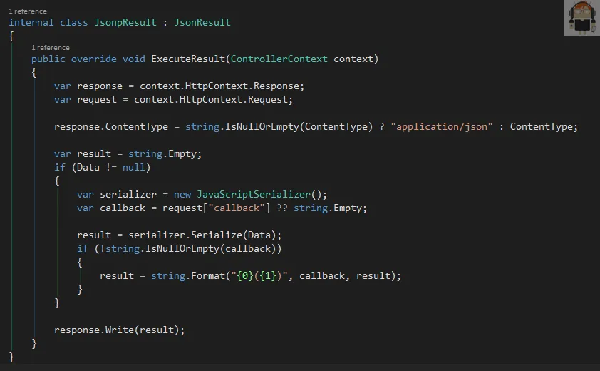
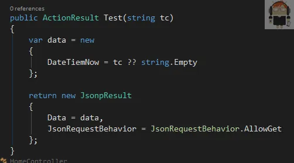
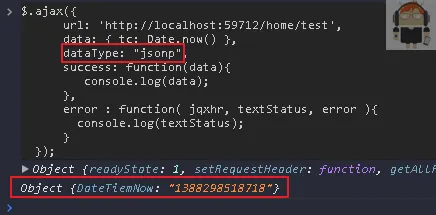
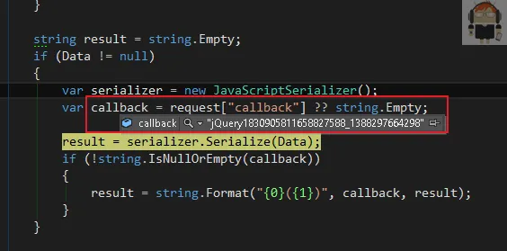
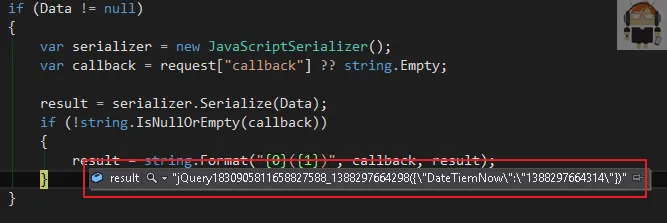
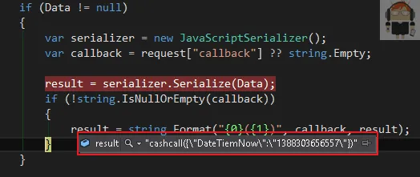

之前公司有用到跨網域存取的需求，所以就研究了一下 Jsonp

先來看在 asp.net mvc 的 Jsonp 要怎麼寫

寫一個自定的 `JsonpResult` 繼承 `JsonResult` 並且 `override ExecuteResult`

用 `context.httpContext` 去取得 `response` 和 `request`

如果沒有指定 `ContentType` ，預設就用 `application/json`

如果有 `callback` 的參數就當成是 `jsonp`，沒有的話就當成一般的 `json`

---

`Controller` 的話就很簡單

最後 `new JsonpResult` 把傳進來的 `tc` 當成 `data` 回傳

---

先測試一下在網址傳入 `tc = 123` 是否有正確的返回

多傳入 `callback = cashcall` 回傳就變成 Jsonp 的格式

---

不過一般是用 jQuery Ajax 呼叫，所以下面改用 Chrome 的 `console` 來作測試

先找一個有 jQuery 的網頁，用 `jQuery.ajax` 來呼叫前面寫好的網頁

會出現 `No Access-Control-Allow-Origin` 的錯誤

這個時候就改用 jsonp 的方式呼叫

多加入 `dataType : "jsonp"` 這樣子就可以正確的呼叫到而且不會出錯

---

下面是執行時的情況

dataType 指定為 `jsonp` 時，jQuery 會自已產生出 `callback`

---

如果要用自定的 `callback` 時

只要多傳 `jsonp : "callback"` 和 `jsonpCallback : "cashcall"` (自定的 callback 名稱)

callback 就會換成自定義的名稱了

---

參考連結：

- [http://www.cnblogs.com/wintersun/archive/2012/05/25/2518572.html](http://www.cnblogs.com/wintersun/archive/2012/05/25/2518572.html)
- [http://stackoverflow.com/questions/4795201/asp-net-mvc-3-jsonp-does-this-work-with-jsonvalueproviderfactory](http://stackoverflow.com/questions/4795201/asp-net-mvc-3-jsonp-does-this-work-with-jsonvalueproviderfactory)
- [http://stackoverflow.com/questions/1647519/jquery-getjson-inside-a-greasemonkey-user-script](http://stackoverflow.com/questions/1647519/jquery-getjson-inside-a-greasemonkey-user-script)
- [http://meebox.blogspot.tw/2012/06/jquery-jsonp.html](http://meebox.blogspot.tw/2012/06/jquery-jsonp.html)