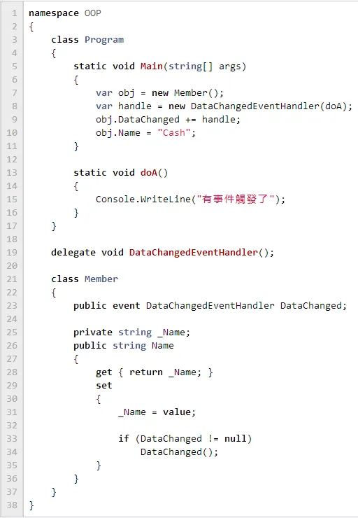
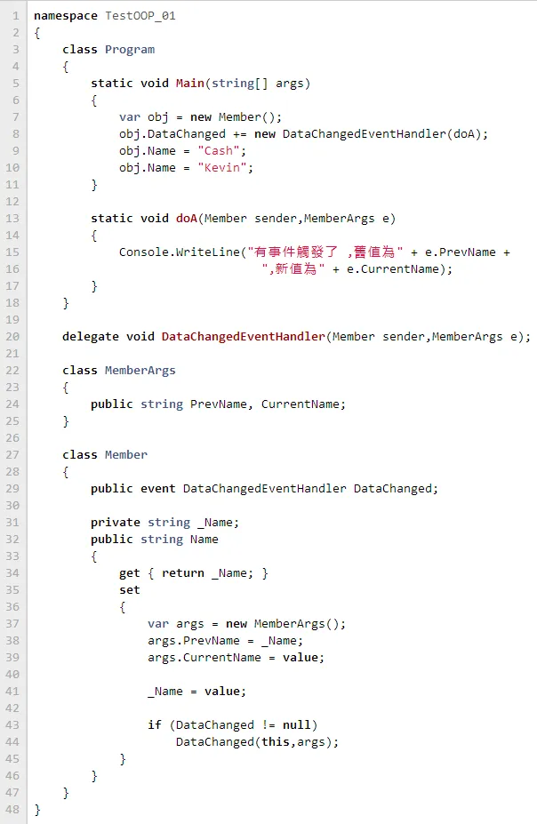
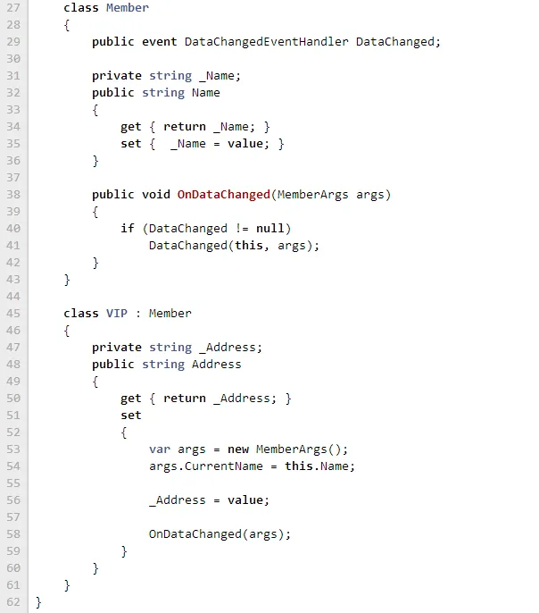

繼上一篇講 `Delegate`，現在要來介紹 `Event`，可以把 Delegate 看成是 Event 的基礎，Event 是建立在 Delegate 之上

直接來看程式碼

我們在 class 裡面 建立一個 event「23 行」

格式為 `存取修飾詞 event「Delegate Method」「Event Name」`

跟在 class 外建立 delegate 的方法一樣

不一樣的地方是利用 `+=` 的方式來註冊 (`hook`) delegate 給 event「9 行」

而不是將 delegate 當作參數傳入

當程式在改變 `Member` 的 `Name` 時，就會執行到 34 行 的 `DataChanged()`

而真正執行的是 13 行的 `doA Method`

---

如果要知道是那個 `Member` 呼叫了這個 `Event` 的話

就把 Member 丟給 Evnet 就好了，程式碼修改如下

在 33 行的地方傳入 `this` 也就是 `Member 本身`

這時候 18 行的 delegate 也要修改成可接受一個 `Member` 的參數

而且 12 行的 `doA` 也要修改的跟 `delegate` 一樣

約定俗成的這個參數名稱會命名成 `sender` (指的是引發這個事件的人)

這個時候就可以知道是誰觸發了這個 Event「14 行」 

---

如果更進一步的想要知道新值和舊值的記錄的話，需要提供比較多的資訊給 Event

程式碼修改如下

先建立一個可以放資料的 class

命名規則通常是在原本的類別名稱後面加上 `Args`，在這裡就是 `MemberArgs`

而在程式裡面建立一個 `MemberArgs` 來記錄新值和舊值「37~39 行」，並且傳給 Event「44 行」

當然 delegate 和 doA Method 也要修改，而 Method 裡面 `MemberArgs` 的參數的名稱通常是叫 `e`

我們可以在程式裡面 set 兩次 Name 來測試，結果如下

---

如果建立一個子類別叫作 VIP 的話，是不是可以 叫用父類別的 Evnet 呢？

答案是否定的，不過我們還是可以用其它的方式來達到，程式碼修改如下

在父類別裡面會建立一個 Method 名稱為 `On「EventName」` 「38 行」

而且這個 Method 通常會使用 `virtual` 這個 keyword

目的是要子類別可以去 `override` 這個 Evnet

而 Event 的名稱通常是用 `「類別名稱」_「Method Name」` 「13 行」

在程式裡面 `+= Event` 時，也可以簡寫成 8 行一樣

而在子類別中就可以透過這個 `On Method` 來使用父類別的 Event「58 行」

最後，我們可以知道

如果子類別有一個 以子類別為名稱開頭的 Event 例如：`Page_Load`

那我們就可以知道 父類別會有一個 以 On 開頭的 Method 也就是 `OnLoad`

註：在 [MSDN](http://msdn.microsoft.com/zh-tw/library/8627sbea.aspx) 裡面也有解釋和範例程式可以看