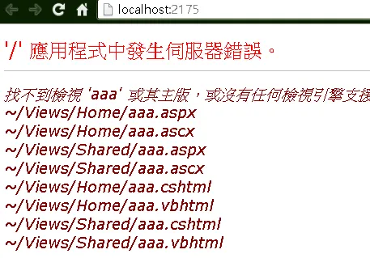
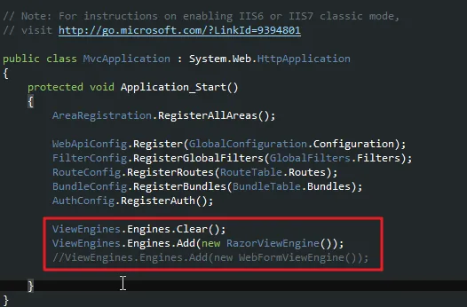
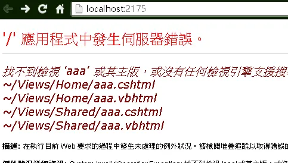
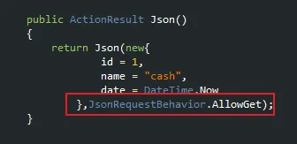
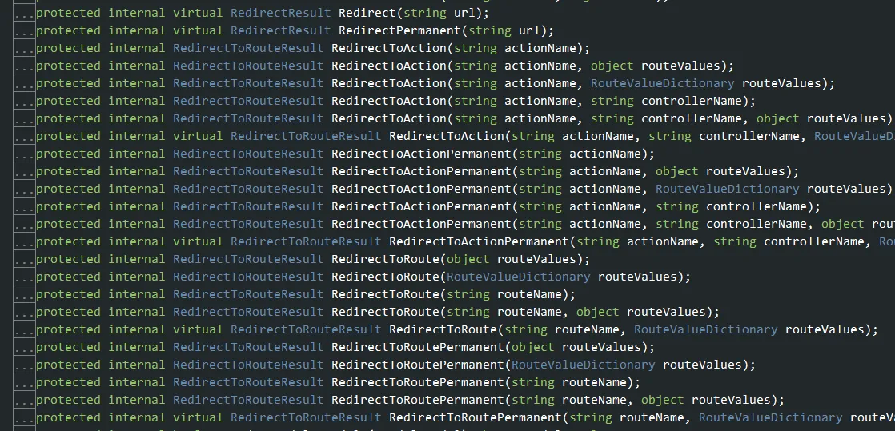
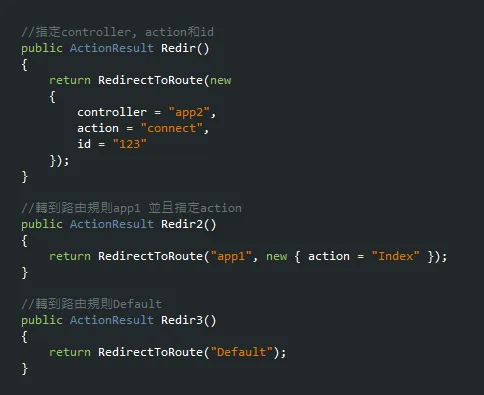

## ViewResult

主要的功能是回傳 `View`

而 `return View` 裡面總共有 8 個 `overloading`，
不外乎指定 `View`、`Model` 或是 `Layout`

在預設的情況之下，View 的名稱等同於 `Action` 的名稱

---

而如果只 `reutnr View` 的話 (只是要顯示畫面)
就可以用比較具像的回傳型別 `ViewResult` 取代 `ActionResult`

這樣子的好處是

1. 肉眼好看，一看就知道是回傳 view
2. 不用在轉型
3. 在 build 的時候就可以知道錯誤

---

如果回傳了一個不存在的 View，網頁就會出現找不到 View 的錯誤

從錯誤中可以知道 View 的尋找順序，會先搜尋和 Controller 同名的 View 目錄，如果找不到時會找 View 下面的 Shared 目錄，而且搜尋時預設先尋找 `.aspx` 、 `.ascx` 再尋找 `.cshtml` 、 `.vshtml`

如果每個 View 都這樣子尋找，而且專案裡面只會用到 `MVC` 的話實在是泿費效能

可以在 在 `Global.asax` 下面加上幾行程式，先把 `ViewEngines` 清空在加上 `RazorViewEngine`，這樣子之後就不會尋找 `WebForm` 檔案，只會搜尋 `MVC` 檔案

註：如果有用到 `WebForm` 的話，就把 `WebFormViewEngine` 放在 `RazorViewEngine` 下面，
這樣子的話找 `MVC` 檔案也會比較快

## PartialViewResult

功能跟 `ViewResult` 一樣，最大的差別就是，`PartialViewResult` 不會載入 `Layout`

有 4 個 `overloading`

## ContentResult

輸出一段沒有修飾的文字，可以自已定義 `Content-Type` 和 `Encoding`

`Content-Type` 定義為 `xml` 輸出時就是 `xml`

有 4 個 `overloading`

註：如同之前使用 `Response.Write` 一樣，千萬不要再使用 `Request` 或 `Response` 物件

## FileResult

主要是下載檔案用，可以輸出任何 `二進制` 的資料，
而如果希望瀏覽器直接下載檔案而不要開啟，可以傳入檔案名稱到第三個參數

有 6 個 `overloading`

- `FilePathResult`：回應一個 `實體檔案` 內容
- `FileContentResult`：回應一個 `byte array` 內容
- `FileStreamResult`：回應一個 `Stream` 內容

---

也可以直接在網頁輸出圖片

---

目前的瀏覽器對中文檔名是沒有問題的，如果是 `舊的IE` 的話就需要加上 `UrlPathEncode` 才會正常的輸出

註：盡量不要指定 `中文檔名` 下載

## JavaScriptResult

主要是輸出一段 `JavaScript` 代碼

和 `ContentResult` 很像，兩個只是 `Content-Type` 不同，`JavaScriptResult` 預設的 `Content-Type` 為 `application/x-javascript`

所以下面兩個的輸出結果是一樣的

沒有 `overloading`

---

也可以利用 return `Partial View` 的方式，在 `View` 裡面輸出 `JavaScript`

## JsonResult

回傳一個 `json` 物件

而且基於安全性，只能使用 `Post方法` 取得資料，
如果要對 `Get` 可以回應，需要加上一個參數來設定

預設的 `Content-Type` 為 `application/json`

---

有 6 個 `overloading`

## RedirectResult

主要為頁面導向使用

有 24 個 `overloading`

- 其實主要就分成三種
    - 1、直接用 `Url` 作導向
    - 2、給 `Controller` 和 `View` 作導向
    - 3、給 `Route` 作導向
- 裡面又可以分有沒有 `Permanent` 結尾
    - 1、結尾有加 `Permanent` 為回應 `HTTP 301` 永久轉址
    - 2、沒有的為回應 `HTTP 302` 暫時轉址

註：如果只給 `路由名稱` 不給任何值的話，預設會以這個路由名稱下的規則和現在的 `controller` 和 `action` 輸出網址

## HtpStatusCodeResult

主要回應不是 `200` 的狀態

- `4xx` 為 Client 端的錯誤
- `5xx` 為 Server 端的錯誤

而因為 `404` 比較特別，所以被獨立出來

還有 授權失敗也是被獨立出來

