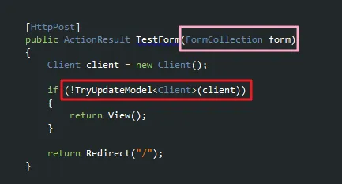

## TempData

寫入 TempData 的資料被讀一次就會被刪除 (一次的 `Request`)，使用 `Session` 來儲存資料

主要是拿來當資料庫寫入成功或是失敗時把資料帶到頁面用

通常會使用 `Redirect`、`RedirectToAction` 或 `RedirectToResult`，不然 TempData 有可能會提前消失

---

## 淺談 Model Binding

解析使用者傳到 Server 的資料，全部都交由 `DefaultModelBinder` 處理

### 簡單模型繫結
頁面上的表單 `欄位名稱` (或是 `QueryString` 的名稱) 和 `Action` 的參數一樣時，在 Action 執行的時候，就會透過 `DefaultModelBinder`，將 `表單` (或是 `QueryString`) 傳來的資料進行處理，傳給 Action 裡面同名的參數

## FormCollection
為繼承 `NameValeCollection` 內容都是 `key` 和 `value`

下面的執行結果和上面是一樣的

### 複雜模型擊結
和簡單模型繫結差不多，只是表單資料對應到比較複雜的型別，通常 `Entity` 的型別都是如此

---

## 淺談資料驗証

### 預先驗証
資料在進到 `Controller` 之前 `Model` 就已經驗証完了

### 延遲驗証
把從表單來的資料手動作 `Model Binding`，這個時候資料還沒有進 `DB`

在 `Action` 裡面作驗証時，用 `UpdateModel` 驗證失敗時會丟出 `exception`，所以通常都是用 `TryUpdateModel`

因為不用在 `Model` 裡面作 `Binding`，所以帶入的 `FormCollection` 根本用不到，而 `TryUpdateModel` 泛型所傳入的參數，就是要被繫結上的資料庫模型物件

如果只有 `特定欄位` 更新時，一定要在 `Action` 裡面加上 `Bind` 的條件或是用 `ViewModel` 的方式，不然會有資安問題

## ActionFilter

