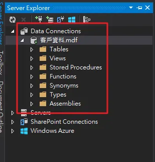
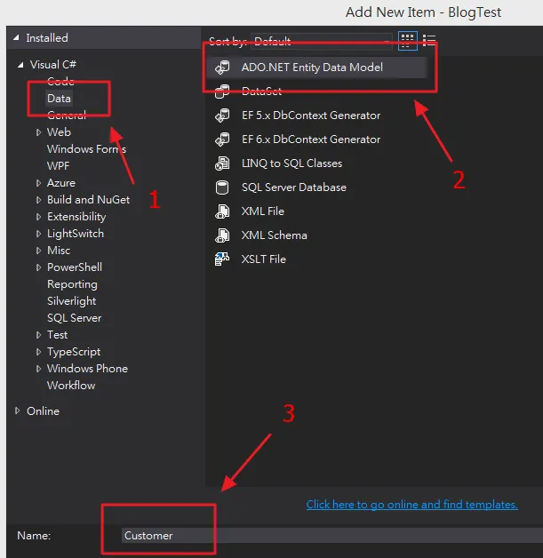
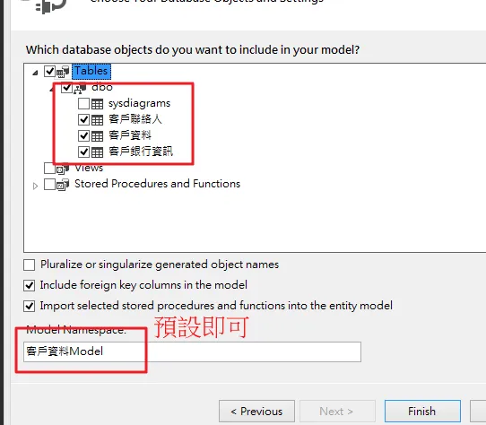
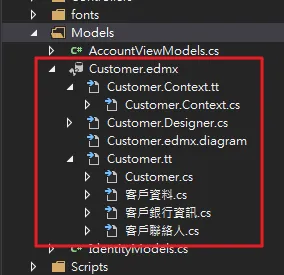
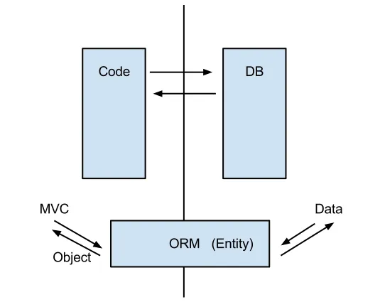
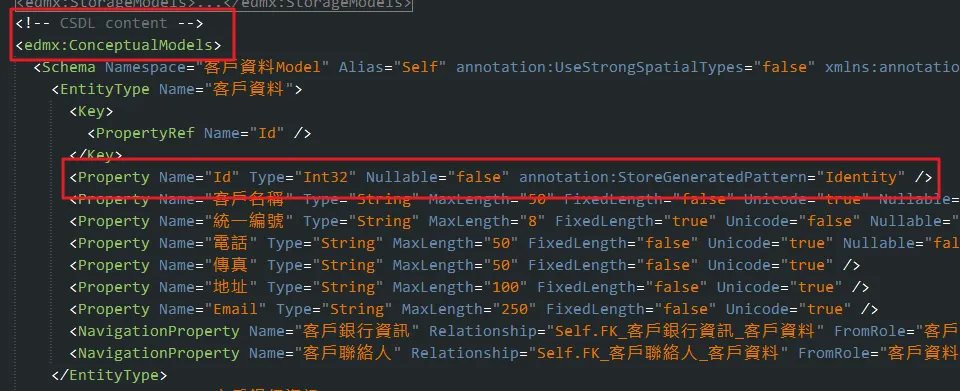
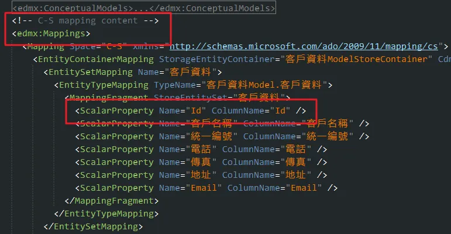
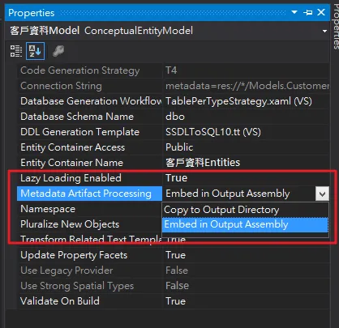
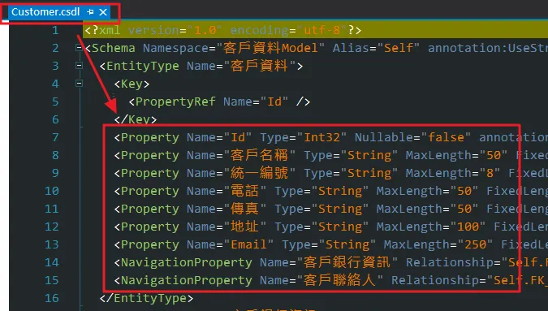

## 建立資料庫模型

新增一個 `MVC` 專案，把測試資料庫拉進 `App_Data` 資料夾裡面 (也可以在資料夾上按右鍵加入存在的項目)

在資料庫上點兩下應該會用 `伺服器管理員` 開啟，確認可以連接到資料庫

在 `Model` 資料夾上按右鍵加入一個 `資料` > `ADO.NET Entity Data Model` > 名稱打 `Customer`

選第一個 從資料庫產生模型

預設會選取剛才有打開過的資料庫，如果這裡空的話就要按右邊的 `新連線` 手動加入資料庫，連線字串預設即可

加入所有的資料表，`sysdiagrams` 為資料庫圖表可以不加入，命名空間預設即可

完成之後就會產生資料庫圖表，並且在 `Model` 裡面產生幾個檔案

- 附檔為 `.tt` 的是 `T4` 的範本，主要是產生 `C#程式碼` 的程式碼
- `*.Context.cs` 是產生跟資料庫的連線，繼承 `DbContext`，背後還是使用 `ADO.NET` 跟資料庫連接
- `*.edmx.diagram` 是存資料庫圖表的相關資料
- `*.tt` 下面是資料表的 `POCO`

## POCO (Plain Old CLR Object)

傳統的 `.NET物件`，在 `ORM` 的中經常被使用，
可當成 DTO (Data Transfer Ojbects) 使用，也就是 Serialize 序列化 和 Deserialize 反序例化

## ORM 技術

將結構化的關連資料 (資料庫) 對映成 物件導向模型 (程式)，
傳統的 `ADO.NET` 的轉換成本很高 (人力成本高)，
開發人員必需先了解資料庫才可以開發，
所以就有這個 `ORM` 的機制，通過這個機制將 `程式碼` 和 `資料庫` 結合 (關連)，
開發人員只要專注於開發就好，
最大的優點就是開發快，
不過在速度和效能上可能是一個問題

## EF 檔案

在 `EF` 檔案上按右鍵，用 `XML 編輯器` 打開

- 註：`EF` 為 Entity Framework 的簡寫，之後都會改用 EF 來表示

打開之後可以看到主要分為三個部份

第一個部份是 SSDL (StorageModels) 這個部份放的是資料庫的資料

第二個部份是 CSDL (ConceptualModels) 這個部份放的是程式碼的部份

第三個部份是 MSL(C-S mapping) 這個部份放的是資料庫和程式碼的對應關系

## EF 的連線字串

`EF` 的連線字串和原本 `ADO.NET` 的不太一樣，
在最前面看到的 `metadata`，指的是會關連到三個檔案，
也就是在 `EF` 裡面看到的三個部份 `SSDL`、`CSDL` 和 `MSL`

我們可以透過設定把 `EF` 編譯輸出成三個 dll

點開 `EF` 檔案，打開屬性視窗 (可以按 `F4`)，
找到 `中斷資料成品處理`，預設是 `內嵌在輸出組件中`，把它改選到 `複製到輸出目錄`，
改完後重新 `Build` 一次

可以在 `專案資料夾` > `bin 資料夾` > `Models 資料夾`，裡面看到那三個檔案，
主要是用副檔名來作區分

如果用 `VisualStudio` 開啟，看到的內容就會跟在 `EF` 裡面看到的一樣

如果打開看連線字串的話，會發現裡面 `metadata` 裡面的位置改成了 `bin 資料夾` 的位置

- 註：如果是把 `Model` 切出去變成獨立專案的話，就需要修改這裡的設定，保哥有一篇文章在講這個設定 [關於 EF 獨立放在 DAL 專案的注意事項](http://blog.miniasp.com/post/2010/06/17/Entity-Framework-DAL-metadata-resource.aspx)