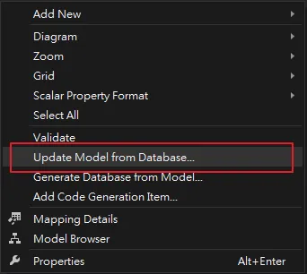
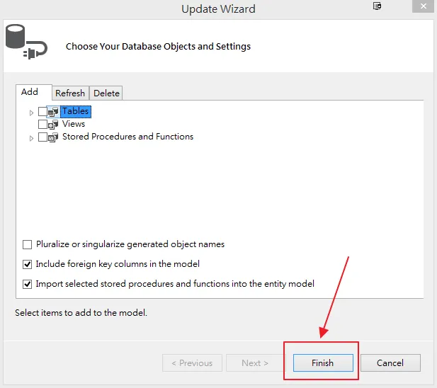
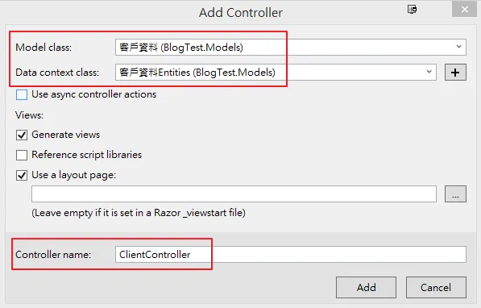
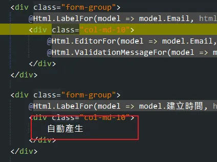
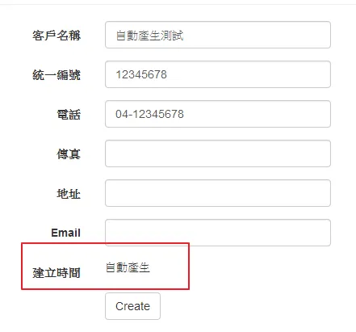
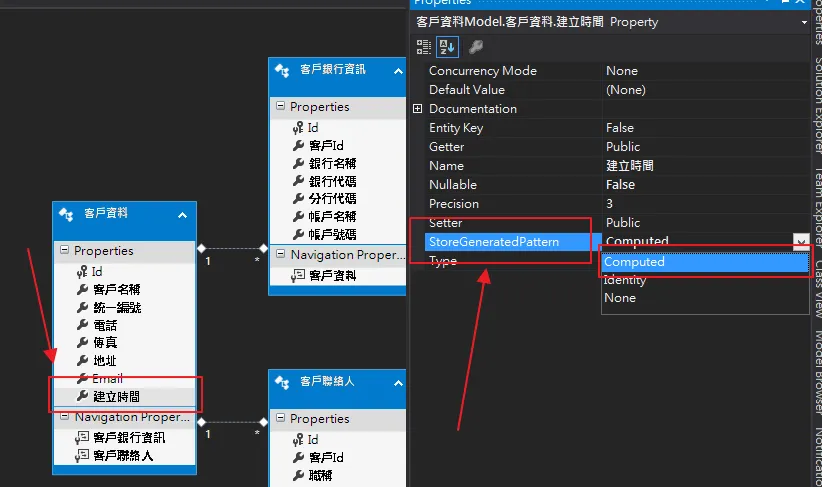
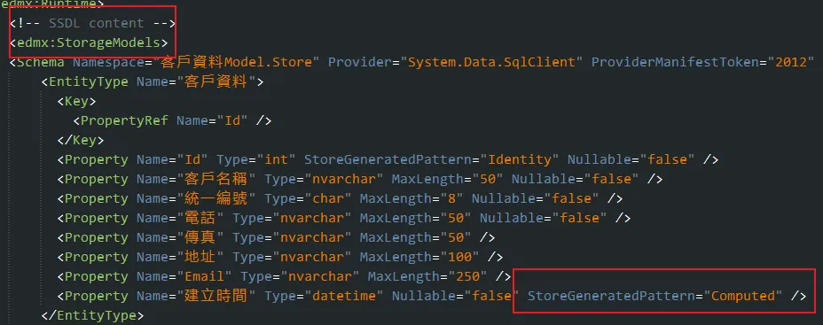

## 資料庫欄位有預設值時處理

先在 `客戶資料` 裡面加一個 `建立時間` 的欄位，Type 為 `DateTime`，預設值為 `getdate()`

打開 `EF`，在空白處按右鍵選擇 `從資料庫更新模型`

出現資料庫選擇的視窗後直接按 `Finish` 就好了

我們可以加入一個 使用 Entity 的 MVC 控制器 來測試

- 註：Controller name 記得不要打中文

因為新增時間為自動產生，所以在新增畫面把它拿掉

在 Controller 部份也要把 Bind 的 Include 的欄位拿掉

新增一筆資料測試

會發現網頁報錯了

- 註：錯誤訊息 (送出的值超出原本 `datetime` 的範圍，請改用 `datetime2`)

真的原因是 `建立時間` 欄位型態為 `DateTime` 而且是不可 null，
送到資料庫時，預設是帶 `0001/01/01`，
而資料庫並沒有把欄位帶入 `getdate()` 的預設值，
而是傳入 `0001/01/01`，所以才會導致出錯

- 註：SQL 2014 DateTime 的範圍為 `1753 年 1 月 1 日到 9999 年 12 月 31 日`

## 解決方法

打開 Entity，找到欄位後按 `F4`，在 `屬性` 裡面找到 `資料產生模式`，預設為 `None`，改選為 `Computed`，
修改後存檔重 Build

註：意思是 程式無論怎麼新增跟修改，EF 都不會更新到資料庫

MSDN 的說明

之後就可以測試新增時是否會帶入預設值 (現在時間)，
編輯時是否不會修改到欄位

如果資料欄位很多預設值的話，用 `XML` 打開 `EF` 直接在 `SSDL` 的地方找到資料表的名稱和欄位，
直接加入程式碼就好了

