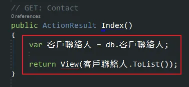
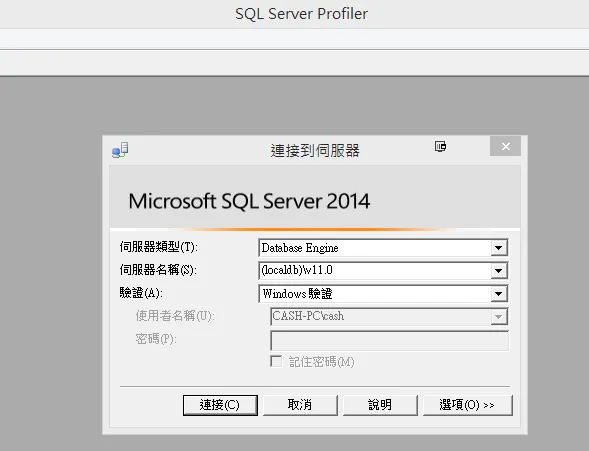
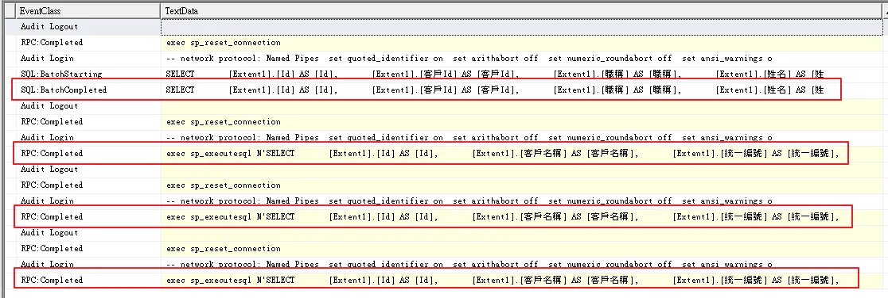
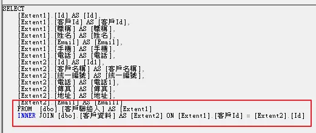

## 有限度的調整 T-SQL 語法，使用 Include 作查詢計畫

先建立一個使用 `EF` 的 `Scaffold Controller`，Model 為 `客戶聯絡人`

並且把原本的 `Index` 修改成沒有使用 `Include` 的方式

打開 `SQL Server Profiler` 作偵測

- 註：這裡沒有要講解 `SQL Server Profiler` 的用法，請自行 'Google'

執行 Index 頁面，可以看到客戶聯絡人裡面有使用到 `客戶資料`

回來看 Profiler 抓到的資料，可以看到除了原本的 `客戶聯絡人` 外，還會在多發出 3 個 `SQL Command` 去抓取 `客戶資料`，
如果頁面資料量多的時候會發出很多不必要的請求給 `SQL`

這個時候就可以使用 `Include`，在取得 `客戶聯絡人` 的同時把 `客戶資料` 也一併取回來

把 `SQL Server Profiler` 清空在跑一次，
可以發現原本的抓取 `客戶聯絡人` 的 `SQL Command` 變成會先 `join` `客戶資料`，
這樣子變成只有下一個 `SQL Command`，可以減少發出不必要的請求

