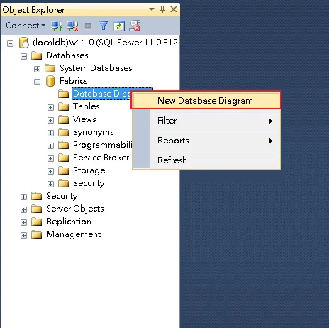
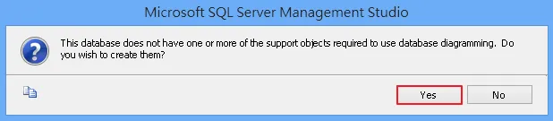
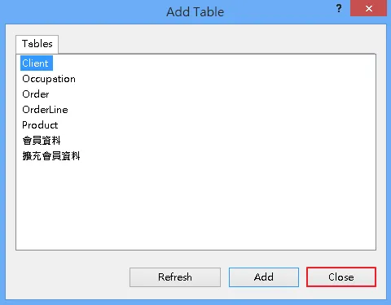
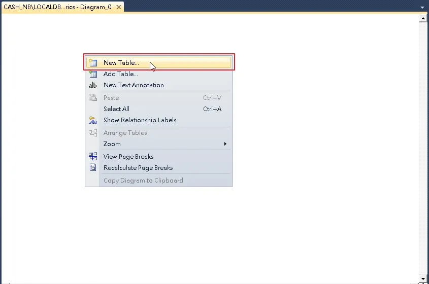
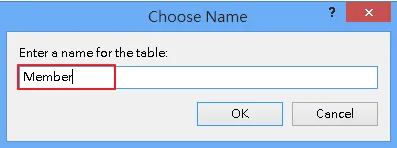
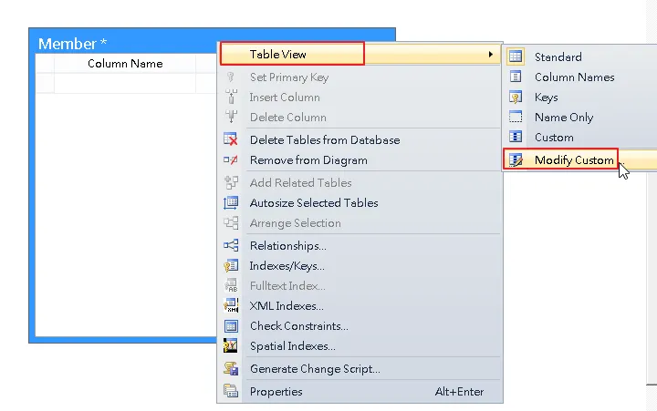
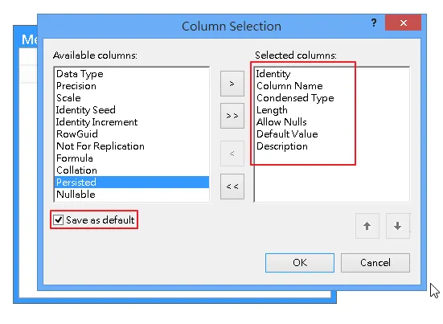
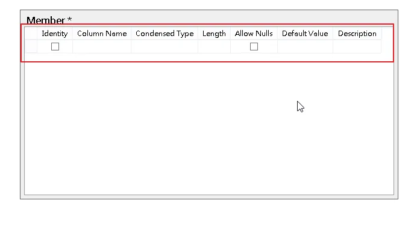
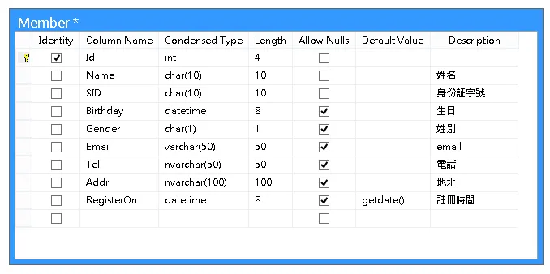
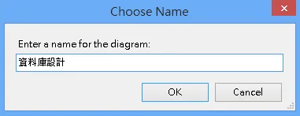

## 使用資料庫圖表作開發

先連結一個資料庫，在資料庫的資料庫圖表上按 `右鍵` 選擇 `新增資料庫圖表`

如果是第一次新增的話，會訊問是否要建立資料庫圖表

之後會跳出視窗叫我們選要加入的資料表，
不過因為我們要自已新增，所以先不加入，按 `Close` 就可以了

在空白處按右鍵新增一個 `新資料表`，打上資料表名稱 `Member`

會新增一個資料表的圖形出來，在圖形的任何一個地方按 `右鍵` 選 `資料表檢視` 的 `使用者自定`

在右邊的視窗依序加入，`識別`、`資料行名稱`、`資料類型`、`長度`、`允許Nulls`、`預設值`、`描述`
然後把最下面的 `儲存為預設值` 打勾，這樣子下次才不用在重新選一次

在設計資料表時，可以先建立所有的資料行名稱，
之後在回頭來想資料的 `類型` 和 `長度`、`是否允許null` 之類的，
這樣子在設計資料表的時候會比較快

資料庫圖表在第一次存檔的時候，會要求輸入資料庫圖表的名稱

存檔之後會發現資料表已經建好了，而且在資料庫下面多了一個系統資料表的資料夾，裡面就存有資料庫圖表的資訊

