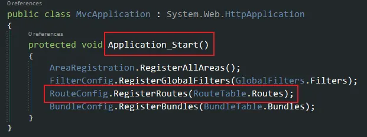
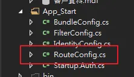
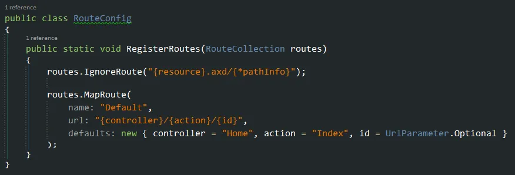

## MVC 的執行生命週期

`Request` => `URL Routing` => `Route` => `Route Handler` =>
一個 Request 進來，網址路由從網址比對取得 controller 和 action 兩個變數

`Http Handler` => `Controller Factory` => `Controller` =>
執行 controller 和 action

`View Factory` => `View` => `Response`
執行 View 並回傳 Response (取決於 ActionResult 如果需要時)

## 網址路由的兩個主要功能 (任務)

- Input：比對瀏覽器傳來的 HTTP 要求，也就是比對網址取得 controller 和 action
- Output：回應適當的網址給瀏覽器，例如使用 @Html.Action 時，背後會去取得 Route 的定義 (參數)，產生網址

## 網址路由的內容

MVC 程式的進入點在 `Global.aspx` 的 `Application_Start()`，其中會將 `RouteTable.Routes` 這個 `static 全域變數` 傳入 `RouteConfig.RegisterRoutes` 這個 `static方法`

RouteConfig 檔案放在 `App_Start 資料夾` 內 (不過這個目錄不是 asp.net 的特殊目錄)

- 講解如下：

1. `{ }` 為變數的代表，如果不是變數，網址上面就一定要出現，如果是變數，要是網址沒有而且又沒有 default 值的話，這一條規則就 failed

2. `routes.IgnoreRoute` ：忽略路由也是是跳過 `RouteHandler` 的管制，不交給 `MVC Handler`，而是交給 `IIS` 的其它模組處理，所以並不會進入 MVC 的執行生命週期

3. `{resource}.axd` ：所有 `*.axd` 的檔案網址後面的 `{*pathInfo}` 表示全部，名稱前面的 * 表示 CatchAll(取得全部) 的意思
  
     - CatchAll 參數只能在 路由 Url 最後一個參數出現
     - 只要網址列出現 .axd 結尾的網址，不管網址後面出現任何路徑，都會被視為跳過網址路由的網址，不希望進 MVC 執行的網址就可以這樣子寫。例如網址是 `/WebResources.axd/a/b/c` 的話，就符合這條路由規則，一但符合其中一條路由規則之後，就會直接 return，下面的規則就不會執行

4. `routes.MapRoute`：定義網址路由的擴充方法，而且是用具名參數的語法

    - `name`：這個參數的名稱，名稱不可重覆
    - `url`：定義 url 樣式和每個路徑段落的參數，其中至少要有 `controller` 和 `action` ，而參數的位置是可以亂放的
    - `defaults`：url 具名參數的預設值，當網址比對不到時會先帶入這裡的預設值在比對一次，如果都不輸入的話，此時預設的網址就是  `Home/Index/`
       - Route 塞預設值的時候是從後面開始塞，如果網址打 `/Home//123` 這樣子是錯的，會出現 404
       - `UrlParameter.Optional`：因為匿名型別不允許屬性值為 `null`，於是創造出一個空的類別出來使用。這就叫作 `Empty Object Design Patter` 或是 `null object Design Patter`
    - `constraints`：限制路由，替網址路由加上條件約束，而且路由參數的名稱不能打錯，條件上可以使用 `Regular Expression`

## 路由比對的注意事項

1. 路由不能以 `/` 、 `~` 開頭，而且不可包含 `?`，也就是不包含 `host` 的部份和 `QueryString` 的部份

2. 小數點 (.)，底線 (_) 跟減號 (-) 會進行參數比對

3. 明確寫在網址列上的一定要出現，少一個字都不行