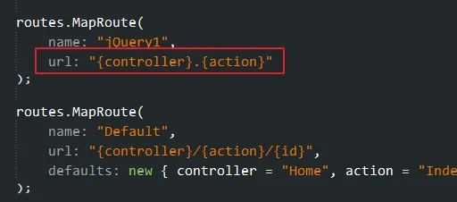
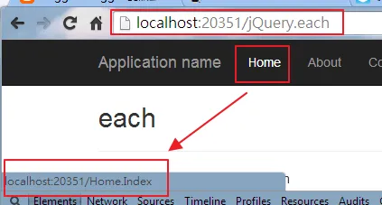
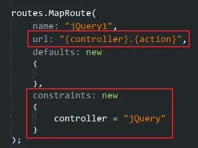
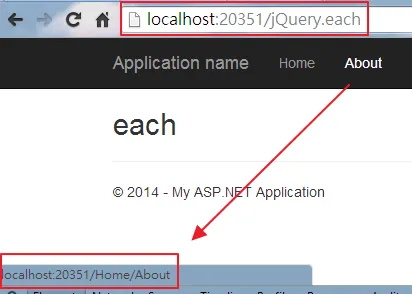
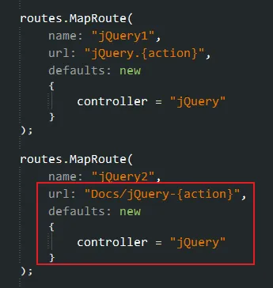
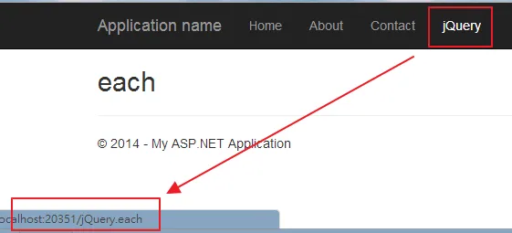

## 實作 Route

假設今天要讓下面兩個 `Url` 都可以連到同一個 `Controller` 和 `Action`

    localhost/jQuery.each/
    localhost/Docs/jQuery-each/

- jQuery 為 'Controller'，each 為 `Action`，Docs 為固定的文字

1、先建立一個 jQuery 的 `Controller`，each 的 `Action`，順便新增 `View`

2、原本預設的 `Route` 設定可以符合所有的條件，所以我們新增的要放在它的上面，
先建立可以符合 `jQuery.each` 的設定

3、測試頁面就會發現明明 `Route` 沒有寫錯，卻發生 `HTTP 錯誤 404.0 - Not Found`，不過這個錯誤是由 `IIS` 發出的，表示 `Route` 沒有比對到

真正的原因是 `.NET 4.0` 跟 `.NET 4.5` 的專案不一樣，只要在 `web.config` 加一段設定就好了

註：保哥有一篇文章在講版本不同專案範本的差異 [ASP.NET MVC 4 在 .NET 4.0 與 .NET 4.5 的專案範本差異](http://blog.miniasp.com/post/2013/06/24/ASPNET-MVC-4-IIS-runAllManagedModulesForAllRequests-ExtensionlessUrlHandler.aspx) 有興趣可以去看

- 可以看到這樣子寫會有一些問題，就是所有輸出的 `Url` 都會使用第一個設定，格式和原本的不一樣

4、所以我們要改寫成 `controller` 為固定值，就沒有這樣子的問題了 (因為輸出時比對不到就會在往下找到原本預設的那一個作輸出)

這裡有兩種方式可以用，選擇其中一種就可以了

- 一種是直接在 `Url` 寫死，不過還是要有 `Controller` 的值，所以就設預設值為 `jQuery`

- 一種是原本的 `Url` 不變，用 `constraints` 作限制

改完之後，原本的 `Url` 正常了，而且自定的 `Route` 也是可以進去

5、第一個沒有問題，第二個 `Url` 的設定就比較簡單了

6、如果我們要讓產出的 `Url` 格式跟我們自定的一樣時怎麼作

可以看到原本的 `HtmlHelper` 的方式是用 `ActionLink` 的方式產生

不過它沒有辦法指定使用那一個 `Route` 的設定產出 `Url`，這時就要改用 `RouteLink` 指定 `Route` 輸出

- 第一個參數通常是 `Link` 的文字，第二個參數是 `Route Name` 也就是 `jQuery1`，後面就是代入 `RouteValue`

可以看到輸出的 `Url` 是我們需要的格式了

## 結論

當整個網站都要自定路由的時候，因為也可能沒有辦法用 `default` 的路由，所以所有的 `controller` 都要自定相關的路由，這是比較麻煩的一件事

在開發初期可以用 `default` 的路由一路開發到底，等到要上線前在來一次調整路由就好

而就算不懂路由也不會影響到 `MVC` 或是網站的開發，不過路由和 `MVC` 習習相關，還是要了解路由的相關知識，才有辦法把 `MVC` 學好