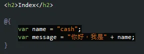
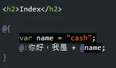
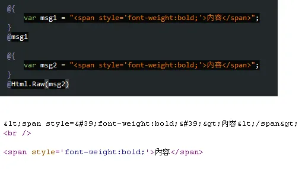
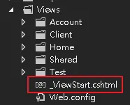
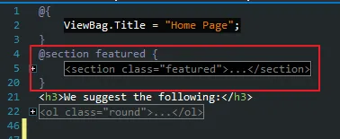

## Razor 語法

`Razor` 不算是一個程式語言，它是一種撰寫風格

---

- 直接輸出程式碼

- `CodeInline` 用在一行程式碼 (一行的陳述式)

- `CodeBlock` 用在多行程式碼，裡面要加分號結尾

- 在 `CodeBlock` 裡面輸出 `Html`，在每一行開頭加 `@：`

- 除了在開頭加 `@：` 之外還可以用 `<tag>`，而且不管 `<tag>` 有沒有意義，被包起來就會輸出成 `Html` 而且 `tag` 會被輸出

- `<text>` 是 `Razor` 專屬的語法，`tag` 並不會被輸出，所以可以用來精準的控制 Html

- 如果要輸出 `@`，需要使用 `@` 當跳脫字元

- 為了避免 `xss` 攻擊，預設所有輸出的內容都會 `HtmlEncode`，如果要原封不動的輸出可以用 `@Html.Raw( )`

## Layout 主版頁面

在 `MVC` 的專案範本中有一個預設的 `/View/_ViewStart.cshtml` 檔案，個檔案會在任何 `View` 被載入前先被載入

而檔案的內容只有一行，定義了 `layout` (主版頁面) 的檔案路徑

在 `/View/` 的每一層內都可以有這個檔案
內層的設定會蓋掉外層的設定
想要設定一些頁面的屬性時可以寫在這裡

`MVC` 的頁面載入順序為

1. `/View/_ViewStart.cshtml`
2. 和 Contorller 同名的 `View 子目錄`下的頁面
3. `/View/Shard/_Layout.cshtml`

所以如果在頁面裡面把資料寫入 `ViewData`，在 `Layout` 裡面是可以讀到的，不過，如果相反的話，因為載入順序的關係，就不行了

---

在 Layout 裡面主要有兩個部分

`@RenderBody()` 為預設坑洞，是 `View` 的主要內容，`@RenderSection()` 為具名坑洞

以上圖為例，定義了一個名稱為 `featured` 的坑洞，第二個 `required` 是指有沒有必要一定出現，如果是 `true` 的話，又找不到相對應可填入的 `View` 時就會出錯

在 View 裡用 `@section` 這個特殊的寫法來對應 Layout 的 `@RenderSection`，而在 View 裡面除了用 `@section` 定義的範圍之外的內容，全部都會被填入 `@RenderBody`</text></tag></tag>