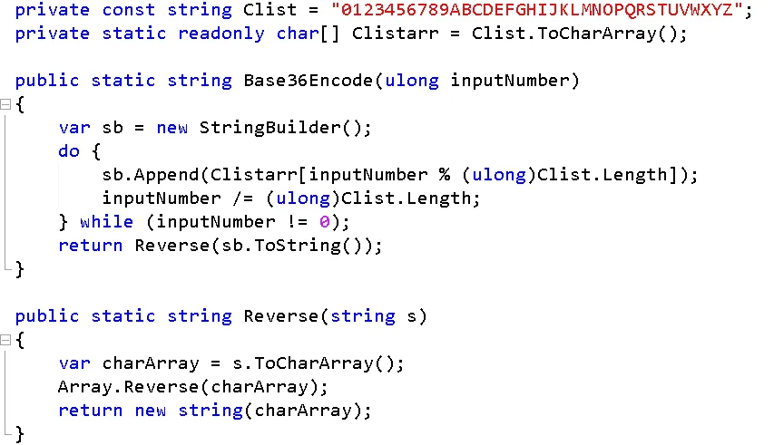
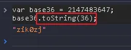

今天在看網路文章的時候看到了 [Base36](http://en.wikipedia.org/wiki/Base_36) (36 進制) 這個東西

覺得很好玩 於是就來記錄一下

`Base36` 的意思是拿一串數字來表示 `數字(0-9)` 和 `英文(A-Z)` 一共有 36 個，
也就是可以把一串數字轉換成 `Base36 string`

以下為 `C#` 程式碼 (來自 `wiki` 裡面)，主要是求出數字的餘數作為轉換，最後在把字串反轉就可以得到需要的結果

`javascript` 的話非常簡單，只要 `toString()`，裡面代入要轉換的 `進制` 就好了

而且用不同語言算出來的結果應該會是一樣的

不過在 `C#` 裡面有型別的限制，導致於傳入的型別和產出的字串長度會有差別

如果用 `int.MaxValue` 產出的字串為 `ZIK0ZJ` 長度為 6

如果用 `ulong.MaxValue` 產出的字串為 `3W5E11264SGSF` 長度為 13

而且在 `C#` 裡面使用的話，我覺得可以寫成 `extend method` 會比較方便

後來想到的應用就是可以利用轉換進制的方法，產生亂碼給 `Captcha` 使用

而且還可以自定字串，例如加入 小寫字母 (a-z) 之類的
不過，這好像就跟 Base36 好像沒有關系 ..XDDD

---

### 參考連結

- [http://en.wikipedia.org/wiki/Base_36](http://en.wikipedia.org/wiki/Base_36)
- [http://flippinawesome.org/2013/12/23/45-useful-javascript-tips-tricks-and-best-practices/](http://flippinawesome.org/2013/12/23/45-useful-javascript-tips-tricks-and-best-practices/)