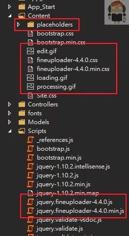
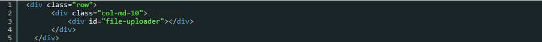
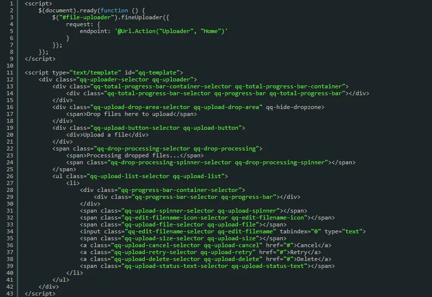
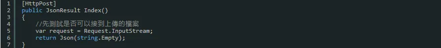
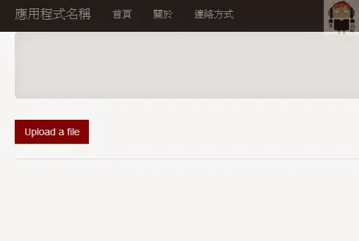
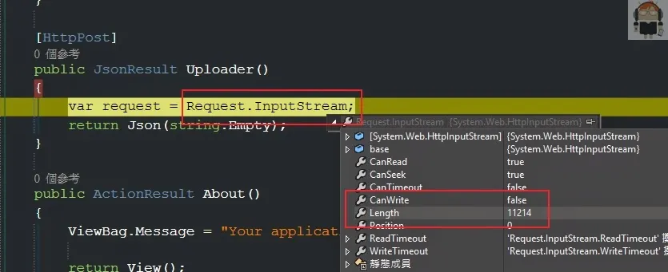
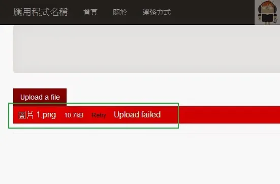
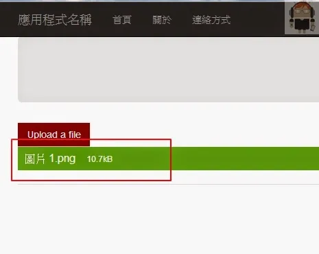
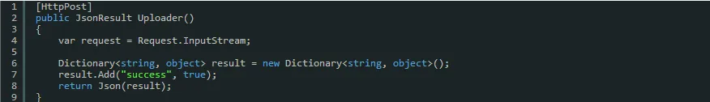

在上一篇文章中最後有產出 js、css 和 html 的 template，我們先把 css 和 js 放到 mvc 的專案中

在 `templates` 資料夾下面會有兩個 html (`default.html` 和 `simple-thumbnails.htm`)
由檔名可以知道，一個可能是會有縮圖的功能，
這裡就拿 default.html 這個檔案來用

步驟如下：

1. 拿 home/index 來修改，把不必要的 html 都刪除
2. 加入一個 div 並且設定一個 id
3. js 裡面，在 `document.ready` 的時候，去設定這個 div 為 `fineUploader`
4. 並且給予上傳的路徑
5. 在把 default.html 裡面的 script 放進來
6. 在 controller 裡面建立一個「post」的 action 給前端上傳用

註：記得在頁面或是 layout 引入 css 和 js

`html` 如下：

`js` 如下：

`controller` 如下：

---

執行程式如果沒有問題的話，畫面上應該會有一個紅色的 `Button`

可以 Debug 看看是不是有接到前端上傳的檔案

不過如果後端什麼都不作，直接返回一個空的 `json`，這樣子前端會出錯

我們可以返回一個 `success` 為 `true`，這樣子前端就會成功了

---

程式如下：

註：後端的檔案上傳處理並不是這裡需要在意的地方，所以並不會在這一個部份著墨太多

這樣子檔案上傳的初步就已經完成了

---

### 參考連結

- [http://fineuploader.com/demos.html](http://fineuploader.com/demos.html)
- [http://docs.fineuploader.com/](http://docs.fineuploader.com/)
- [http://kevintsengtw.blogspot.tw/2012/01/aspnet-mvcfile-uploader.html](http://kevintsengtw.blogspot.tw/2012/01/aspnet-mvcfile-uploader.html)