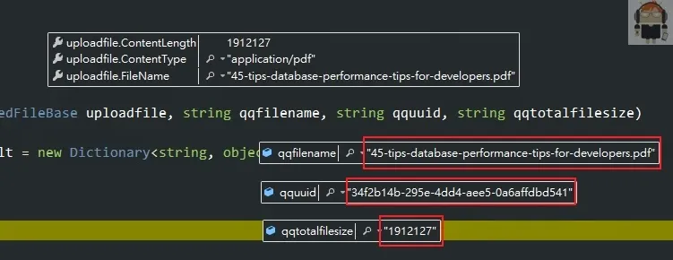
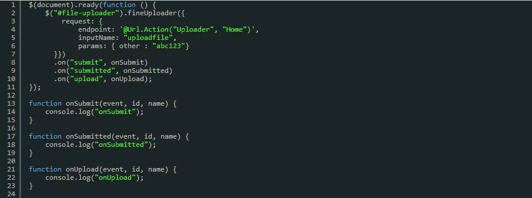
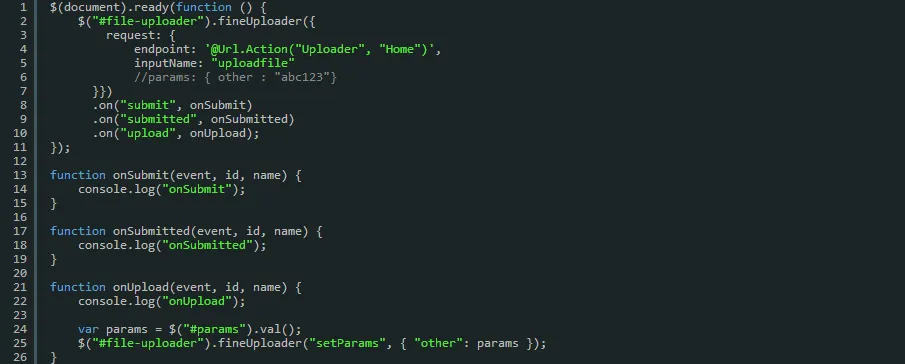
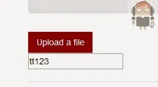

在 Fine Uploader(二) 中，我們已經完成基本的雛形，現在要來針對每個細節來作調整

這次的內容主要是下面兩個主題：

1. 後端接收參數調整
2. 傳入額外的參數

## 後端接收參數調整

上篇文章只有說用 `InputStream` 可以接到傳進來的資料，
如果我們可以利用強大的 `model binding` 來作處理應該會比較方便，
在這裡我們可以使用 `HttpPostedFileBase` 來作檔案的處理，

不過，我們的參數的命名要叫什麼？
這是一個大問題，如果名稱沒有對應的話是不會作 `binding` 的

- 註 1、可以去看官方的文件或是查看原始碼就會知道
- 註 2、對 `HttpPostedFileBase` 不熟的可以去看 kevin 大 寫的文章，[ASP.NET MVC - 檔案上傳的基本操作](http://kevintsengtw.blogspot.tw/2013/03/aspnet-mvc.html)

在[官方的文件](http://docs.fineuploader.com/api/options.html#request.inputName)，可以知道預設的名稱為 `qqfile`，
原始碼的話在 `3185行`

`controller` 修改如下：

debug 可以看到傳進來的檔案了

如果要自定義這個參數的話，也是可以

`JS` 修改如下：

在這裡把名稱改為 `uploadfile`，相對的 `controller` 裡面的名稱也要修改

debeg 可以看到，一樣可以接到檔案

---

在後端還有三個參數可以使用 `filenameParam`、`uuidName` 和 `totalFileSizeName`

- `filenameParam` 預設名稱為 `qqfilename` ，主要是 檔案名稱
- `uuidName` 預設名稱為 `qquuid` ，主要為 上傳時套件自已產生的 guid
- `totalFileSizeName` 預設名稱為 `qqtotalfilesize` ，主要為 檔案的大小

官方文件如下：

- [filenameParam](http://docs.fineuploader.com/api/options.html#request.filenameParam)
- [uuidName](http://docs.fineuploader.com/api/options.html#request.uuidName)
- [totalFileSizeName](http://docs.fineuploader.com/api/options.html#request.totalFileSizeName)

原始碼在 `3186 ~ 3188 行`

測試一下，可以看到
`qqfilename` 和 `HttpPostedFileBase` 接到的 `FileName` 是相同的

`qqtotalfilesize` 和 `HttpPostedFileBase` 接到的 `ContentLength` 是相同的

檔案大小的話因為 `HttpPostedFileBase` 裡面已經有了，
所以其實不必在寫參數去接收，
檔案名稱因為會有修改檔名的問題，所以必須使用，
而 `guid` 在刪除檔案時會使用到

而這三個參數也是可以自定義，寫法跟 `inputName` 一樣，在這裡就不在說明了

---

## 傳入額外的參數

如果我們有傳入其它參數的必要，
可以在 js 裡面加上 `params`

[官方文件 request.params](http://docs.fineuploader.com/api/options.html#request.params)

- 註：可以看到 `default` 是 `{}` ，所以可以傳入多參數

JS 修改如下：

後端就可以用 `other` 接收到前端傳來的參數，
debug 看到可以接收到前端傳來的 `abc123`

不過這裡的參數是寫死的，
如果要動態傳入某個 input 的值就必須寫在 `event` 裡面才可以

[官方文件 events](http://docs.fineuploader.com/branch/master/api/events.html)

裡面有寫到，上傳前的事件主要有三個 `submit`、`submitted` 和 `upload`，
在這裡最好的執行點為 `upload`，也就是`上傳前`

- 註：如果是分二階段上傳的話，寫在 `submitted` 會有影響，建議寫在 `upload` 就可以不用作修改

JS 修改如下：

可以在 `function` 裡面寫 `console.log`，先測試執行的順序

先在 html 裡面增加一個 `input` id 為 `params`，
在 `onUpload` 時去取這個 input 的值再設定給參數，
在 method 裡面有一個 `setParams` 可使用

[官方文件 setParams](http://docs.fineuploader.com/branch/master/api/methods.html#setParams)

JS 修改如下：

- 註：原本設定裡面的 `params`，跟這裡的 `setParams` 會有衝突，要把原本的註解掉

debeg 可以看到，已經可以接到來自前端 input 的內容了

---

### 參考連結

- [http://kevintsengtw.blogspot.tw/2012/02/aspnet-mvcfile-uploader-part2.html](http://kevintsengtw.blogspot.tw/2012/02/aspnet-mvcfile-uploader-part2.html)