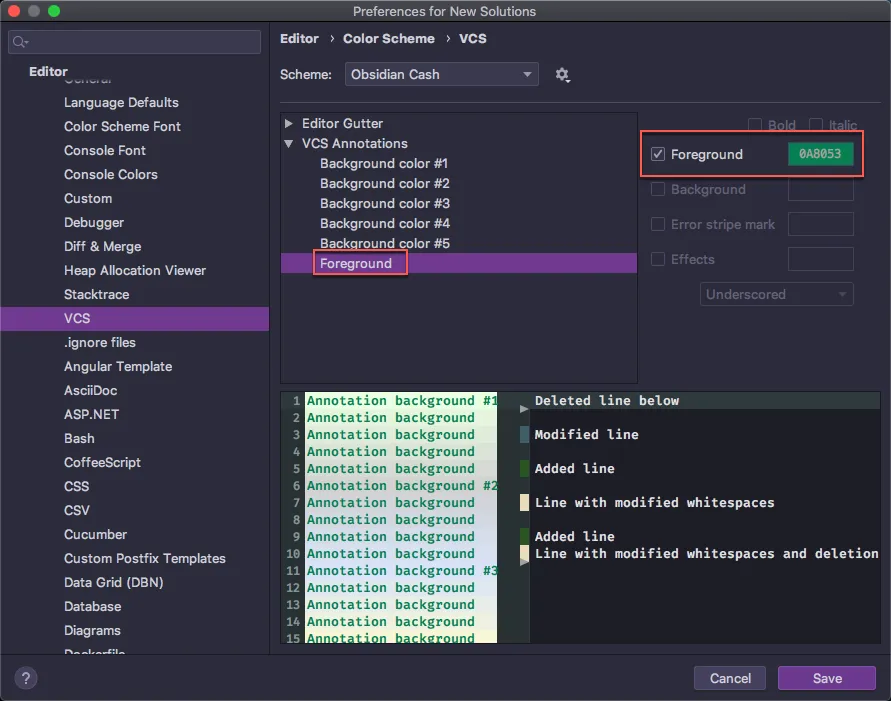

有在 Rider 裡面用 `IdeaVim` 的套件一定會在多安裝 [Relative Line Numbers](https://plugins.jetbrains.com/plugin/7414-relative-line-numbers) 這個套件來顯示相對行號，不過預設的顏色實在是很難看，如果要修改顏色的話可以參數下圖的位置來修改

> 註：只要是 JetBrains 的 IDE 都可以使用 

