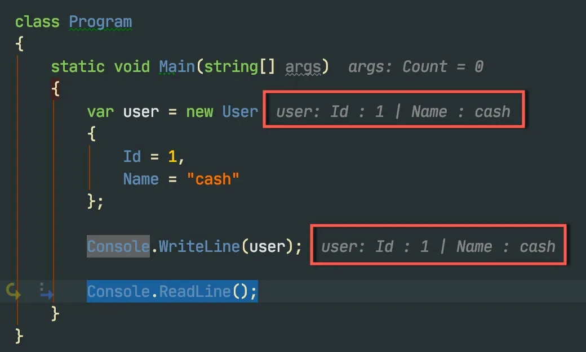
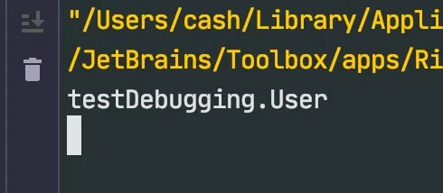
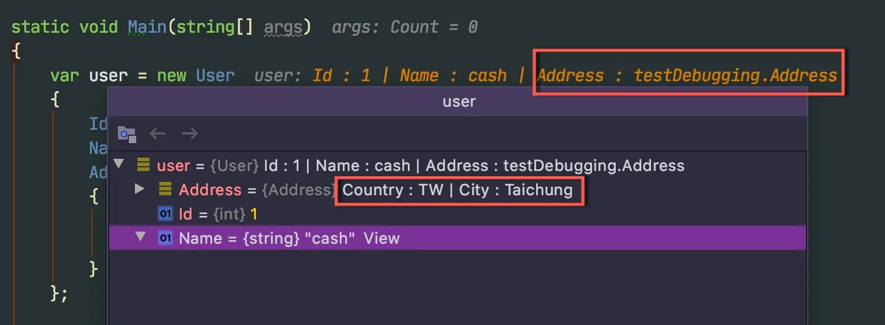
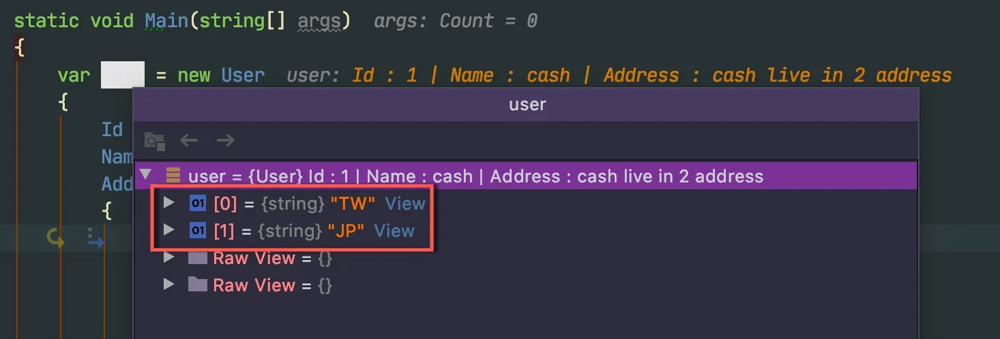

> 這裡使用的 IDE 是 `Rider`，有可能在 `Visual Studio` 上面的呈現不同

## 使用 DebuggerDisplay

### 單一物件

範列程式碼如下

```csharp
class Program
{
    static void Main(string[] args)
    {
        var user = new User
        {
            Id = 1,
            Name = "cash"
        };

        Console.WriteLine(user);

        Console.ReadLine();
    }
}

public class User
{
    public int Id { get; set; }

    public string Name { get; set; }
}
```

現在 debug 的話會出現這樣子的畫面，如果我們想要快速的在畫面上看到 user 的相關資訊的話，可以借助 `DebuggerDisplay` 這個 attribute 


程式碼修改如下，要特別注意的是 `DebuggerDisplay` 裡面並不用使用 `字串插值`的方式，而且在打 property 的話會有提示

```csharp
[DebuggerDisplay("Id : {Id} | Name : {Name}")]
public class User
{
    public int Id { get; set; }

    public string Name { get; set; }
}
```


Debugger 的時候看到的相關資訊就會改變了



不過這個資料並不會直接輸出，它只會在 Debugger 的時候出現



### 複合物件

程式碼修改如下

```csharp
static void Main(string[] args)
{
    var user = new User
    {
        Id = 1,
        Name = "cash",
        Address = new Address
        {
            Country = "TW",
            City = "Taichung"
        }
    };
}

[DebuggerDisplay("Id : {Id} | Name : {Name} | Address.Country : {Address.Country} | Address.City : {Address.City}")]
public class User
{
    public int Id { get; set; }

    public string Name { get; set; }

    public Address Address { get; set; }
}

public class Address
{
    public string Country { get; set; }

    public string City { get; set; }
}
```

Debugger  結果


也可以把 `DebuggerDisplay` 寫到另外一個物件，修改如下

```csharp
[DebuggerDisplay("Id : {Id} | Name : {Name} | Address : {Address}")]
public class User
{
    public int Id { get; set; }

    public string Name { get; set; }

    public Address Address { get; set; }
}

[DebuggerDisplay("Country : {Country} | City : {City}")]
public class Address
{
    public string Country { get; set; }

    public string City { get; set; }
}
```

Debugger 結果，可以看到 Address，因為是物件，所以無法在第一層物件就直接看到相關資訊，不過點開 Debugger 視窗就可以看到



### 集合物件

程式碼修改如下，可以自定 `private` 的 `property` 給 `DebuggerDisplay` 使用

```csharp
static void Main(string[] args)
{
    var user = new User
    {
        Id = 1,
        Name = "cash",
        Address = new List<Address>
        {
            new Address
            {
                Country = "TW",
                City = "Taichung"
            },
            new Address
            {
                Country = "JP",
                City = "Toke"
            },
        }
    };
}

[DebuggerDisplay("Id : {Id} | Name : {Name} | Address : {MyAddress}")]
public class User
{
    public int Id { get; set; }

    public string Name { get; set; }

    public List<Address> Address { get; set; }

    private string MyAddress => $"{Name} live in {Address.Count} address";
}

[DebuggerDisplay("Country : {Country} | City : {City}")]
public class Address
{
    public string Country { get; set; }

    public string City { get; set; }
}
```

Debugger 結果


## 使用 DebuggerTypeProxy

程式碼修改如下

- 先建立一個 `private class` 放在原本類別裡面，類別上面要多掛 `DebuggerTypeProxy` 

- `constructor` 傳入外面的類別

- 在需要呈現的 `property`  上面掛 `DebuggerBrowsable` 裡面的值先給 `DebuggerBrowsableState.RootHidden`

有關於 `DebuggerBrowsableState` 的設定可以參考官方的[文件](https://docs.microsoft.com/en-us/dotnet/api/system.diagnostics.debuggerbrowsablestate?view=netcore-3.1)

```csharp
[DebuggerDisplay("Id : {Id} | Name : {Name} | Address : {MyAddress}")]
[DebuggerTypeProxy(typeof(AddressDebugView))]
public class User
{
    public int Id { get; set; }

    public string Name { get; set; }

    public List<Address> Address { get; set; }

    private string MyAddress => $"{Name} live in {Address.Count} address";

    private class AddressDebugView
    {
        private readonly User _user;

        public AddressDebugView(User user)
        {
            _user = user;
        }

        [DebuggerBrowsable(DebuggerBrowsableState.RootHidden)]
        public List<string> Countries => _user.Address.Select(x => x.Country).ToList();
    }
}

[DebuggerDisplay("Country : {Country} | City : {City}")]
public class Address
{
    public string Country { get; set; }

    public string City { get; set; }
}
```

Debugger 結果，可以看到打開就是 `AddressDebugView` 的 `Countries` 裡面的值



原本的內容就放在第二個 `Raw View` 裡面


修改 `DebuggerBrowsableState` 為 `DebuggerBrowsableState.Collapsed`，Debug 結果


修改 `DebuggerBrowsableState` 為 `DebuggerBrowsableState.Never` 的話就是不修改原本的 Debugger 呈現