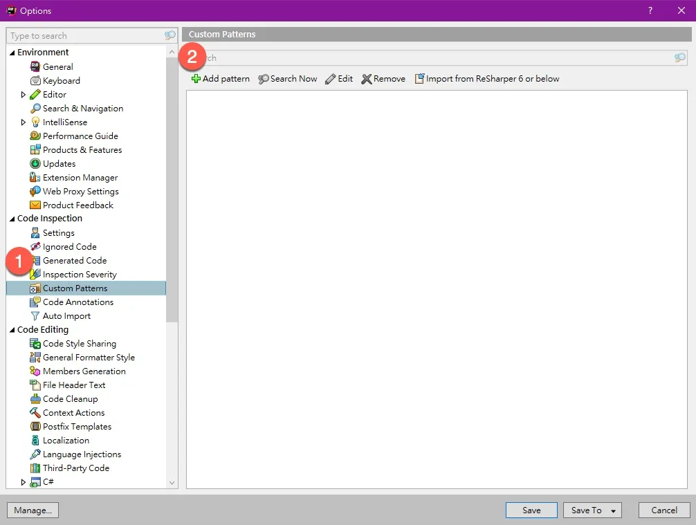
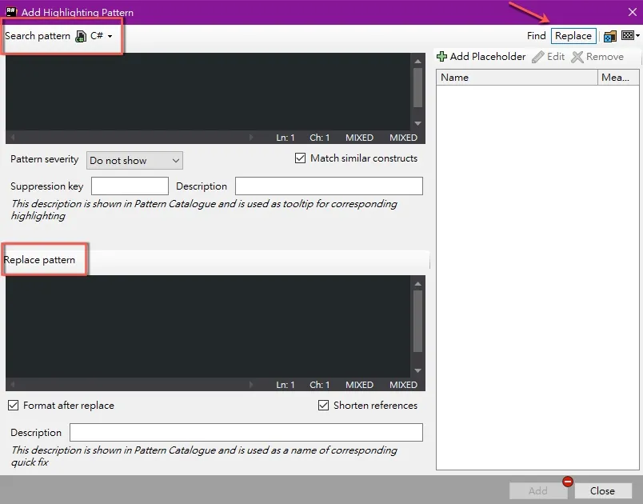
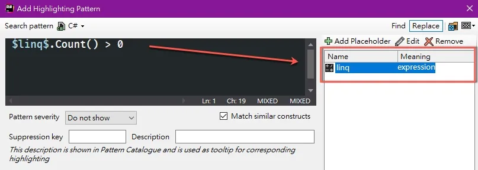
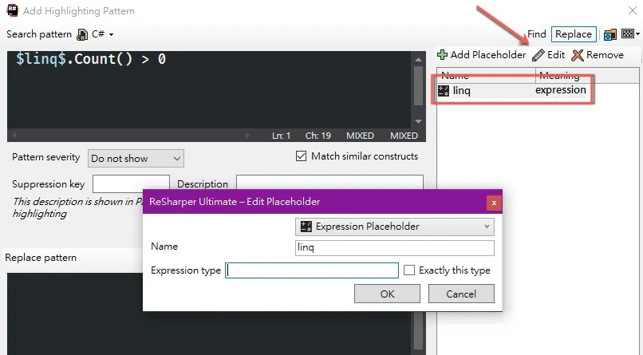
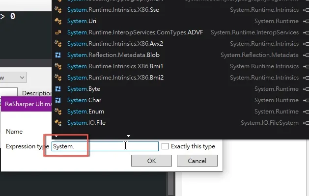

> 下面會用 `Edge` 的 `下載` 功能來示範如何修改快捷鍵

先到你要修改的應用程式，看你需要修改功能的`名稱`，這裡就叫 `下載`

來到系統的 `系統偏好設定` 的 `鍵盤`

點選 `鍵盤` 的 `快速鍵`

左邊選擇 `App 快速鍵` 選擇 `+` 加入一個新的設定

-   `應用程式`選擇 `Edga`
    
-   `選單名稱` 就是你要修改應用程式的名稱，這裡就是 `下載`
    
-   `鍵盤快速鍵` 就直接按你要的快捷鍵，這裡是用 `command + j`
    

最後按 `加入` 就完成了

回到原本的應用程式，試試看剛才加入的快捷鍵是否已經生效 😀