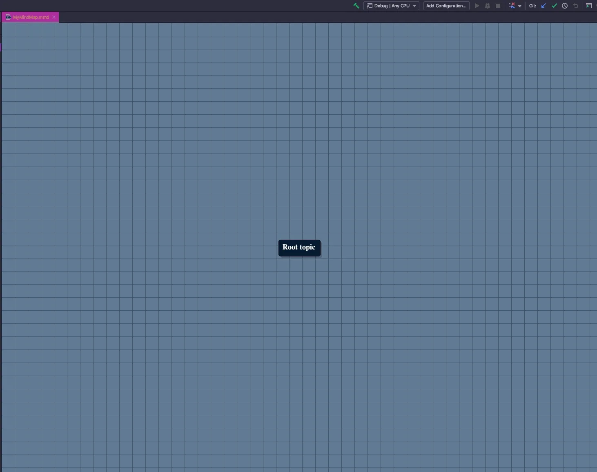
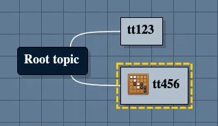

> 套件 [IDEA Mind Map](https://plugins.jetbrains.com/plugin/8045-idea-mind-map)

> 這個套件是從 [NetBeans 的 MindMap](http://www.igormaznitsa.com/netbeans-mmd-plugin/) 移植而來

## 新檔案

安裝完套件後，在任一專案裡面的 `新增檔案` 裡面就會出現 `Empty Mind Map` 的檔案

選擇後，給定檔案名稱

就會進入 `Mind Map` 的編輯畫面

這個檔案就可以加入版控，團隊共享

實際上的 `mmd` 檔案也是 `Markdown`，如果用文字編輯器開可以看到裡面的格式大制上是 `Markdown`

## 子節點

在節點上面按 `右鍵` 就會出現選單，選擇 `Add child` 會可以加一個子節點 (按 `Enter` 可以快速建立子節點)

## 編輯文字

在節點上按 `兩下` 就可以編輯文字

## 物件

在節點上面可以新增不同的物件

-   note
-   file
-   URI
-   jump
-   Image
-   Emoticons

新增之後選項會變為 `Edit`

### note

### file

檔案的話只是加入引用路徑，並不是複製一份到 MindMap

### URI

### jump

### Image

圖片的話比較特別，是直接加入圖片或者只是引用路徑，選擇完圖片會有選項可以選

### Emoticons

## Import

可以從不同的 MindMap 軟體 import 進來，一些主流的軟體都有

## Export

相對的，也可以 export 到不同的 MindMap 軟體

要注意的是，export 為 `Markdown` 的話，加入的檔案和圖會變成 `檔名`，下面為對造圖

## Options

選項裡面可以修改基本的 `底色` 、`字型` 還有 `快捷鍵` 可以修改

