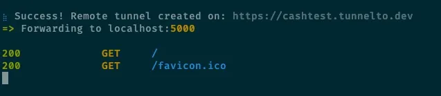

之前的文章 [內網穿透神器 Serveo 介紹](https://blog.cashwu.com/blog/tool-serveo-expose-local-to-internet) 有介紹 [Serveo](https://serveo.net/) 這個內網穿透的神器，現在要來介紹另外一個 open source 的穿透神器 tunnelto.dev

- [tunnelto.dev 官網](http://tunnelto.dev)
- [Github 網址](https://github.com/agrinman/tunnelto)

## 基本使用

- 先在官網右上角點選 `Get a Free API Key` ，然後輸入 `email` ，然後按 `Send sign-in link` 就可以拿到登入連結，它會寄到你剛才填入的信箱

- 去信箱收信就可以看到連結

- 點連結就可以到 `Dashboard` ，最上面可以看到 `Authentication Key` 等一下要認證用

- 畫面最下面有 `QuickStart Guide` ，mac 的話推薦使用 `brew` 安裝

- 安裝時忘了截圖，所以就跳過了 XD

- 安裝完後要認證才可以使用

- 選定自己要的 `subdomain` 和要穿透的 `port`，下面有出現 `Success` 就表示成功了

- 如果 `subdomain` 被使用走了，也會出現提示

- 可以用剛才設定的 `subdomain` 測試了 (這裡是用手機測試)，如果有流量進來的話下面會出現相關的資訊

## 後記

1. 目前測試下來速度不太穩定，時快時慢的
2. 沒有看到有像 `ngrok` 一樣的背景執行，表示要一直開著 `command line`
3. 有對外一個 subdomain 的設定，Dashboard 裡面的 `Subdomains` 區塊沒有看到有使用記錄，不知道是不是付費版本才有，還是這是 bug，等到付費之後在來測試
4. 因為是使用別人家的 server 轉向，所以重要服務請三思，不然就自己 host
