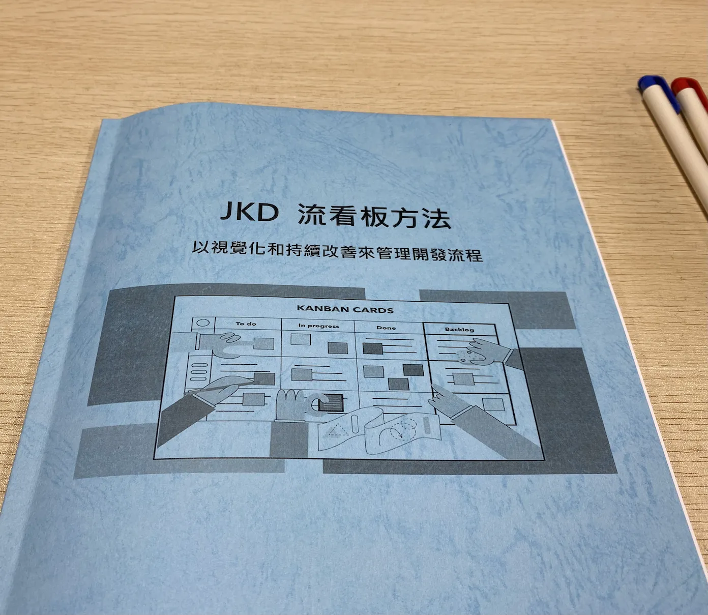

## 前言

從接觸敏捷之後，陸續的接觸 (學習) 過 kanban 的相關知識，不過一直沒有系統化的學習 kanban，為了解決 I don't I don't，所以才會想要報名課程，看會有什麼火花。

## 心得

基本上只寫出我覺得 `AHA` 的點 !!

### 第一天

讓我 AHA 的地方是： `kanban 是變革管理的工具`。

白話文的來說，就是可以在即有流程 (不改變流程) 的情況下，把原本的工作流程先視覺化成 kanban 的 flow，然後再一步一步的導入相關的 policy，讓團隊在不知不覺中 (溫水煮青蛙) 就養成比較好的工作流程。

所以，如果想要導入敏捷，與其一開始就從 scrum 這種改變幅度比較大的流程開始，不如先從 kanban 開始，成功的機率會比較高一點。所以才說 kanban 是變革管理的工具。

### 第二天

讓我 AHA 的地方是：`加一個 Next 的欄位`。

早上課程中的一個 lab：把目前的工作流程用 kanban 的方式視覺化。寫完後我在上去分享時，David 問了我一個我沒有想過的問題，如何知道現在 todo 裡面 task 的先後順序，我當下不假思索的回答，直接寫在 task 上面，David 又問，如果要調整的話，是不是所有的 task 都要劃掉重寫，恩，這樣子的解法好像沒有說很好，另外一個想法是，直接用 task 排列的先後順序來看，不過如果太多的話，或是被移動的話，那不就也會有問題。

David 的解法是，在 todo 和 doing 中間加入一個 `next` 的欄位，把今天 (之後) 要作的 task 先放在這個欄位，來解決先後順序的問題。以 scurm 的角度來說，就是訂出 `每天的 sprint goal`。

原本沒有想到的問題，想不到加入一個欄位就可以解決，真的是意想不到。

## 後記

一直都覺得自己了解 kanban 已經還算不少了，沒想到上課時還是有不少 `AHA` 的點，其實要學的東西還是很多 (淚)，果然自己看書和學習還是有不少盲點，最好的方式還是要去上課，畢盡講師已經系統化的幫你整理了相關的知識，尤其是大名鼎鼎經驗豐富的 `三叔公`, 品質就是有保證。

最後，我們這一組大多都是老司機，課程結束後的成績也碾壓其它組別，獲得講師贈書 `kanban in action 看板實戰` 一本，不過，其實這本我已經有了，不過還是很努力的回答問題 XD。
