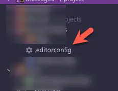
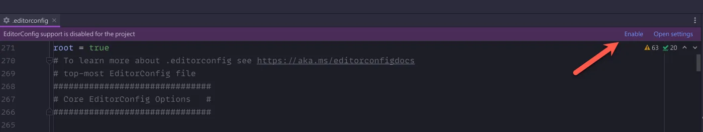
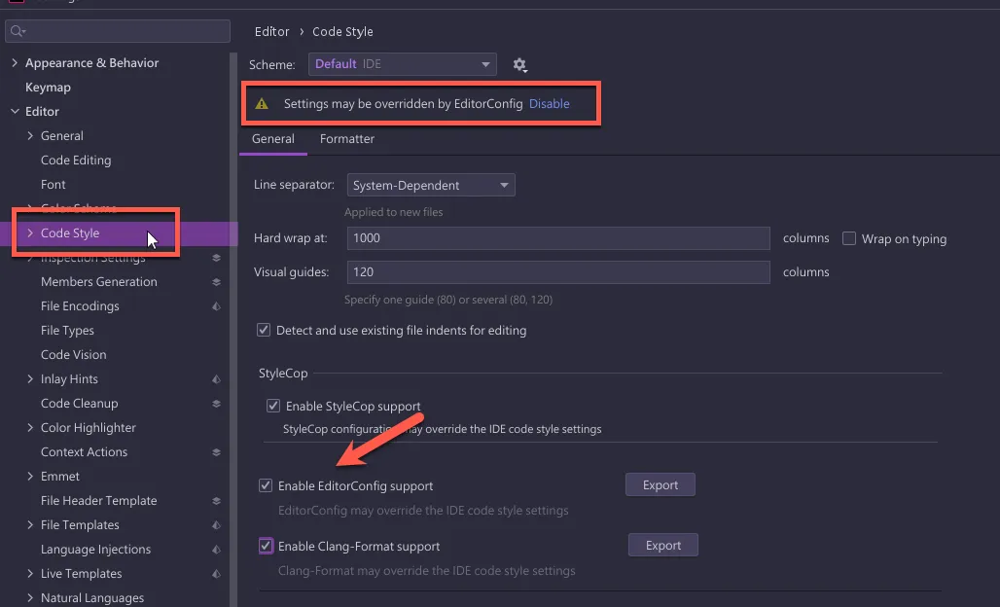
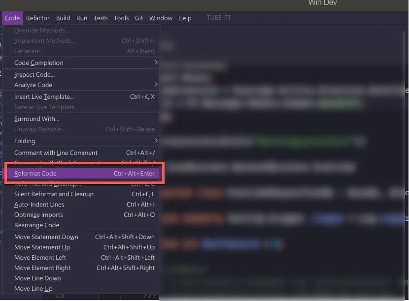

Rider 支援 EditorConfig (Rider 官網 [Use EditorConfig](https://www.jetbrains.com/help/rider/Using_EditorConfig.html) ) 的 Code Style，下面就讓我們看怎麼啟用

## 啟用 EditorConfig

如果專案裡面已經有 `.editorconfig` 的檔案，直接打開檔案，上面就會有提示訊息，直接按 `Enable` 就可以啟用支援

- 如果在檔案上面沒有出現提示訊息的，確認一下 Rider 的 plugins 是不是有安裝 [EditorConfig](https://plugins.jetbrains.com/plugin/7294-editorconfig)，並且啟用

另外，也可以在設定的 `Code Style` 裡面點選 `Enable EditorConfig support` 啟用，如果已經有啟用了，在上面也會有訊息提示說，設定可能被 EditorConfig 覆寫

可以使用 `Reformat Code` 來試試看是否已經有吃到相關的設定檔

## 相關 EditorConfig 設定

在 Rider 的官網 [EditorConfig properties](https://www.jetbrains.com/help/rider/EditorConfig_Properties.html) 也有相關的網頁跟你說 Rider 相關的 Code Style 設定在 EdiotrConfig 裡面需要用什麼值

 - 在測試上發生，有些設定程式碼的 before 跟 after 區塊都是一樣的，在找設定上，這點必需要注意

在微軟的官網 [程式碼樣式規則選項](https://docs.microsoft.com/zh-tw/dotnet/fundamentals/code-analysis/code-style-rule-options?view=vs-2022) 也有相關的說明網頁，不過相對於 Rider 來說，這裡的設定值就比較少，應該只有列出標準的 C# code style