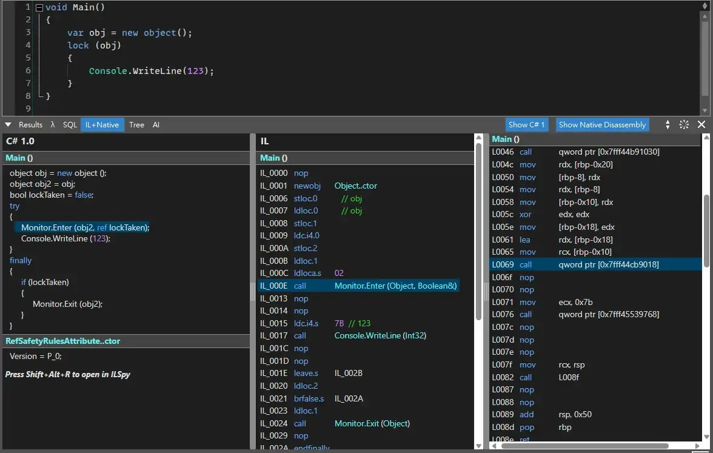

前幾天有工程師問我，如果 `lock` 的區塊發生 exception 之後，會不會 unlock ?
這是個好問題，翻了一下官方的文件，以下的程式碼節錄至 [官方文件 lock statement - ensure exclusive access to a shared resource](https://learn.microsoft.com/en-us/dotnet/csharp/language-reference/statements/lock)


```csharp
lock (x)
{
    // Your code...
}
```

如果 `x` 是 `reference type` 的話，上面的程式碼相等於下面的程式碼

```csharp
object __lockObj = x;
bool __lockWasTaken = false;
try
{
    System.Threading.Monitor.Enter(__lockObj, ref __lockWasTaken);
    // Your code...
}
finally
{
    if (__lockWasTaken) System.Threading.Monitor.Exit(__lockObj);
}
```

如果我們用 LINQPad 試試看產生出來的 `IL code`，基本上跟官網說的一樣，會自動在 lock 的程式碼區塊包 `try-finally`，在 finally 的時候 `unlock`




---

> 圖片來源 Photo by [Ariel](https://unsplash.com/arielbesagar?utm_source=unsplash&utm_medium=referral&utm_content=creditCopyText) on [Unsplash](https://unsplash.com/photos/Oal07Ai4oTk?utm_source=unsplash&utm_medium=referral&utm_content=creditCopyText)
