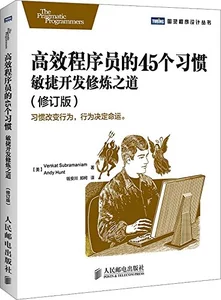
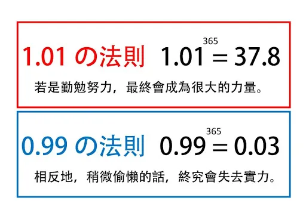

這本書是我在帶團隊，大家必看的一本書 (有興趣的話，可以參考另外一篇文章 [工程師必備](https://blog.cashwu.com/blog/must_for_engineers)])

文章內容，是在之前公司內，我舉辦的讀書會，我整理的一些內容，基本上都是我要特別點出來跟大家分享的重點。

## 第一章 敏捷 - 高效軟體開發之道

- 敏捷開發就是在一個高度協作的環境中，不斷地使用反遣進行自我調整和完善

## 第二章 態度決定一切

- 對項目、工作、事業有一個專案的態度時，使用敏捷方法才會生效

### 01 做事

- 不是解決發生問題的人，而是解決問題
	- 對事不對人 (「03 對事不對人」)
- 重視結果 > 過程 (ISO 9001)

### 02 欲速則不達

- 解決表面的問題，可能最後會引發更大的問題
	- 重點在於 always Workaround，而不代表 Workaround 不對
	- 欠債不是問題，重點在於沒有還債
- 程式碼難以理嶰
	- 程式碼是大家的「40 實行代碼集體所有制」
	- code review「44 做代碼複查」
	- unit test「19 守護天使」

### 03 對事不對人

- 重點在於解決問題，而不是誰比較厲害
- 全體一致真的是好的結果嗎 ? (全員投票通過)
	- 討論時間拉長 - 設定 deadline
	- 找出優點最多缺點最少 - 逆向思維
	- 有一個引導人 - 設立仲裁人
	- 重點在解決問題，而不是誰提出的 - 支持已經做出的決定
- 讓大家都可以勇敢的發言 (出聲)
	- 不要臉才學的會「04 排除萬難，奮勇前進」

### 04 排除萬難，奮勇前進

- who will bell the cat ?
	-  誰是那個人 ?
- 抱怨不能解決問題
- 如果發現問題，有勇氣向其它人說出問題
	- 勇氣和魯莽有時只在一線之隔 (改完全不理解的程式碼)
- 我認同沒有時間是個問題，問題是你做了什麼來解決這個問題 [91](https://www.facebook.com/photo/?fbid=411847674292162&set=a.411847640958832)

## 第三章 學無止境

- 學習如逆水行舟，不進則退

### 05 跟蹤變化

- 技術更新的很快，要怎麼學習 ?
	- 迭代增量學習
	- 了解最新行情
	- 參加本地的活動
	- 參加研討會
	- 閱讀
- 技術的本質才是重點 (請參考 [Cash Wu Geek - 工程師必備 - 曹祖聖 - 微軟技術無所不通 - 教你成為 IT 界的德魯伊](https://blog.cashwu.com/blog/must_for_engineers))

### 06 對團隊投資

- 一個人走的快，一群人走的遠
	- 團隊的教育訓練
- 午餐會議
	- 固定時間學習
- [請參考「初心」43:10](https://www.netflix.com/title/81342639)
- [dinner](../日劇-dinner-不斷的進步/index.md)

### 07 懂的丟棄

- 一直使用同樣的工具/方法 => 敏捷的根本 - 擁抱變化
- 是否把舊的態度和方法，用在新的技術上
	- 用 vb 的方式寫 c#...
- 丟棄的第一步 -> 意識到你還在用過時的方式

### 08 打破砂鍋問到底

- 醫生怎麼看病的方式 ?
-  為什麼是個很好的問題
	- 5 why 方式
	- 要問對問題 / 問好問題
- 跟「02 欲速則不達」有點像

### 09 把握開發節奏

- 敏捷會議會有節奏和循環
	- scrum 約定 30 天之內不變 => 基本上是錯的
- 個人的開發節奏
	- 上班喝咖啡
	- 下班前要 commit 一版
- timebox 
	- 時間固定
	- 內容可以變動
	- 例如開會 1500 - 1600 
	- 重點在於不要浪費時間
		- 如何有效的開會，這是另一件事情
- 迭代時間「17 使用短迭代，增量發布」
- 站立會議「38 定期安排會面時間」

## 第四章 交付用戶想要的軟件

- 真正的敵人是「變化」
- 為什麼要讓用戶/客戶參與開發

### 10 讓客戶做決定

- 客戶沒有做決定 -> 結果不是客戶要的 
	- 沒有滿足需求
- 有兩個方案，一定是做最簡單的那個嗎 ? 
	- 開發者不應該要決定「業務」方面的事
	- 技術會影響邏輯的實作，不過基本上應該要解偶找到一個平衡
- 決定什麼不該決定
	- 應該要讓客戶做決定
	- 如果 PM/主管要自己做決定的話「04 排除萬難，奮勇前進」
- 記錄下客戶做出的決定，並註明原因在某個地方
	- 技術決策的記錄
- PO 是誰的人 ? 
	- 客戶還是公司內部的人

### 11 讓設計指導而不是操縱開發

- 設計師 -> 架構師
- 敏捷是不是不用作設計 -> 這是錯的
- 善用 UML 
	- Class Diagram
	- Sequence Diagram
- 設計的文件叫另外一個人實作「39 架構師必需寫代碼」
	- 是不是有按設計進行
	- 時間不夠了怎麼辦
- 設計滿足實現即可，不必過於詳細 
	- 看情況
- 分成「戰略」和「戰術」
	- 戰略 
		- 前期階段只描述戰略，不應該深入細節
	- 戰術 
		- 程式開發階段在精確的描述細節
			- 參數，方法
- 設計會跟著了解的狀況而一直修改
- 計劃是沒有價值的，但計劃的過程是不可少的 - 艾森豪

### 12 合理的使用 (新) 技術

- 履歷驅動設計
- 技術選型
	- 技術框架真的可以解決問題
		- POC
	- 你會被它拴住嗎 
		- open source / 付費軟體
	- 維護成本是多少
- 公司的整體技術走向
- 不要開發你可以下載到的東西
	- open source

### 13 保持可以發布

- 已提交的代碼應該隨時可以行動
- 防止破壞系統的程式碼
	- run test
	- git pull / fetch
	- run test
	- git push 
- 要有 CI
	- 正在開發
	- 每個環境

#### 平衡的藝術

- 長期的項目是個例外
- 不可以讓系統不可以發布，又不可以 rollback

> 比較好的解決方法 TBD (feature toggle)

### 14 提早集成，頻繁集成

- 上一個章節的 CI
- 團隊開發很重要
	- 測試是另外一個重點
- 每次 run
	- 最少每天要 run

> 開發到同一功能時，會更明顯

### 15 提早實現自動化部署

- CD
- 快速，減少人為因素
- 先上 prd 驗證，減少其它外部問題，例如 db/ 3rd party
	- 很像藍綠部署

> 開新專案第一件事情就是加 CI/CD

### 16 使用演示獲得頻繁反饋

> 軟體開發 唯一不變的真理就是 需求一直在變

> ruddy 老師：少增量，多迭代，尋求回饋 (agile)

- 項目術語表
	-  Ubiquitous Language

### 17 使用短迭代，增量發布

- 迭代，增量
- 夠用的軟體 vs 完全的軟體
- 趕快上線賺錢

> 怎麼拆分大項目變小，是另外一個問題

### 18 固定的價格就意味著背叛承諾

> 軟體買斷 vs 訂閱

## 第五章 敏捷回饋

- feedback 是 agile 裡面很重要的觀念
- 這裡放大到每一個軟體開發上面

### 19 守護天使

- coding feedback - unit test 
	- 應該是 all automation test
	- isolation unit test 
- CI 
	- 有測試沒有 CI，那有跟沒有一樣
- unit test 的價值
- 有效的 unit test 比數量多來的重要

> 在一定的時間內，平衡是很重要

### 20 先用它再實現它

- eat your dog food
	- TDD 
- 把測試當成軟體第一個使用者
	- 從測試可以看出很多問題
		- 好不好寫
		- 參數是不是好用

> 開發前需要分析和設計

### 21 不同環境，就有不同的問題

- 上次的「15 提早實現自動化部署」有提到類似的觀念
- 如何在測試環境完整的模擬正式環境

### 22 自動驗收測試

- 測試金字塔

### 23 度量真實的進度

- 估計的目的是什麼 ?
- 完成百分比有意義嗎 ? 
	- 重點是離目標的距離
- 之前的「17 使用短迭代，增量發布」有講到項目拆解的問題
- 一般軟體開發會用 5 ~ 6 來估計一天的時間，而不是 8 

### 24  傾聽用戶的聲音

- 發生問題大多都不是使用者的問題
	- 這個議題很大
- 在前面的「16 使用演示獲得頻繁反饋」也有提到類似的概念

## 第六章 敏捷編碼

### 25 代碼要清晰的表達意圖

- 可讀性 -> 表達意圖
- fix bug
	- 理解程式碼
	- 改那裡
	- 修改
	- 測試
- 寫註解「26 用代碼溝通」 
- PIE 原則 
	- program intently and expressively 意圖清楚表達明確
- 不知道什麼時候會再次看
- 現在不做，之後也不會做
- 有意圖不代表一定是更多的 class/ type

### 26 用代碼溝通

- 程式碼文件
	- 程式碼本身
	- 利用註解來溝通程式碼之外的問題
- 命名很重要 
- 噪音註解
	- IDE 加入
	- 沒有什麼幫助
- C#
	- summary /// 
		- method
		- param
		- returns 
		- exception
- 為什麼要這樣子寫程式碼比較重要

### 27 動態評估取捨

- 先求有再求好
- kent beck 開發三階段 [Make It Work Make It Right Make It Fast (c2.com)](http://wiki.c2.com/?MakeItWorkMakeItRightMakeItFast) 
	- make it work
	- make it right
	- make it fast
- 大部份的優化都不在瓶頸 Bottleneck 上面
- 高德納 - 過早的優化是萬惡之源

### 28 增量式編程

- 小地方開始，而不是大範圍的改動
- 重構很重要
- 「20 先用它再實現它」TDD 就是一種增量式開發
- 測試的執行速度應該是很快的
- 重構測試

### 29 保持簡單

- Ockham's Razor 
	- 奧卡姆剃刀法則
- 簡單不是簡陋
- simple design
	- [91 敏捷開發之路 - 什麼叫做好的程式？大家的答案都不一樣，甚至在自己不同的職涯階段，答案也都不一樣。](https://www.facebook.com/91agile/posts/1212412078933408)
- 重構需要平衡，而不是一直下去
 
### 30 編寫內聚的代碼

- 高內聚低耦合
- SRP 單一職責

### 31 告知，不要詢問

- [Tell Don't Ask (martin fowler)](https://martinfowler.com/bliki/TellDontAsk.html)
- CQRS
	- Command Query Responsibility Segregation
- method 非預期的附作用
	- 查詢去修改資料

### 32 根據契約進行替換

- liskov 替換原則
	- 兒子的地方都可以使用爸爸
- 繼承是被亂用最多的概念之一
	- 重點不是重用程式碼
- 優先使用組合取代繼承

## 第七章 敏捷調試

- 沒有辦法用固定時間來限制，不過可以設定持續時間

### 33 記錄解決問題的日志

- issue 處理的方式
	- wiki 
- 重點在可以搜尋

### 34 警告就是錯誤

- ide 的 warning 

### 35 對問題各個擊破

- 單元測試可以帶來分層的好處
	- 至少可以定位到那個組件有問題，而不是全部都要看
- prototype 
- 大部份的程式碼都是耦合在一起的
	- 導致於沒有辦法拆開判斷
- 二分法查找

### 36 報告所有的異常

- 不要隨便補抓異常
	- c# 預設會處理，屬第二級
- 萬惡的 null
- [例外處理實戰 (skilltree.my)](https://skilltree.my/Events/2023/3/19/exception-handling-batch-3)

### 37 提供有用的錯誤信息

- log 
- 開發階段遇到問題，是否有辦法用原有的 log 來解決
- 註：一些信息是不能被 log 的

## 第八章 敏捷協作

### 38 定期安排會面時間

- 整個的重點在 daily scrum 
- 為什麼叫站立會議 ?
- 雞和豬的故事
- 不開不需要開的會議

### 39 架構師必需寫代碼

- 之前 Jed 分享過的主題
	- 太空架構師
- 平常就在分析和設計

### 40 實行代碼集體所有制

- 程式碼是大家的
- 大家應該都要知道其它人在幹麼
- 一個 team 的概念

### 41 成為指導者

- 教學相長
- pair 是不是也是廣義的
- blog

### 42 允許大家自己想辦法

- 被動餵食 ?
- 以團隊來看
	- 大家要一起討論找出解法
- 以指導來看
	- 重點是要給方向，而不是答案
	- 視情況而定

### 43 準備好後再共享代碼

- 指的是 push 上去 / merge 回去共用的分支
- 頻繁的提交，是有前提的
- 最低的要求 - 通過測試，沒有 warning 
- 書裡面提到的方式都是比較舊的方法

### 44 做代碼複查

- code review 的重點在解決什麼問題
- 在這裡就不討論作法和型式

### 45 及時通報進展與問題

- 有問題，馬上反應
	- 最慢會等到「38 定期安排會面時間」daily 
- 團隊大家都可以看到的
	- 實體看板

## 第九章 尾聲：走向敏捷

- 一個新的習慣開始
- 循序漸進
	- 重點在改善

---

> 圖片來源：網路。若分享內容有侵害您的圖片版權，請來信告知，我們會及時加上版權信息，若是您反對使用，本著對版權人尊重的原則，會儘速移除相關內容。
