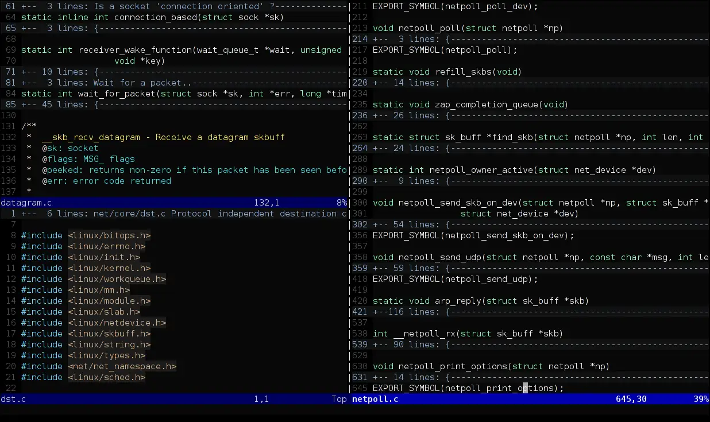
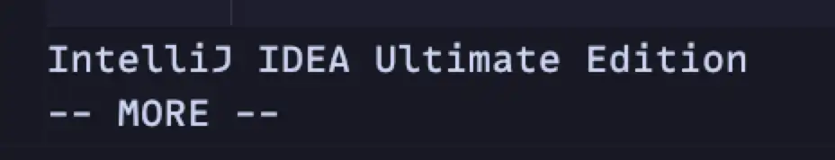

<!--  -->

如果有多個 `JetBrains` 的 IDE 要使用，而且又有在用 `ideavim` 這個套件的話，常常會因為不同 IDE 的設定檔感到麻煩，就來看如何使用套件提供的 [IDE specific options](https://github.com/JetBrains/ideavim?tab=readme-ov-file#ide-specific-options) 功能，來達到判斷 IDE 切換 `ideavimrc` 設定檔的功能

重要的第一步，是要確認目前的 IDE 名稱，才有辦法判斷，官方提供了 `:echo &ide` 命令，可以取得目前的 IDE 名稱

下面是我用 `IntelliJ` 和 `Rider` 的結果




### ideavimrc 設定檔

可以先拿官方提供的設定檔來改，然後判斷的部份，我發現好像不用寫全名，也是可以判斷的到，官方的範例甚至可以判斷不同的 IDE 版本，另外，我這裡是使用不判斷大小寫的方式 `=~?`

記得把 `<path>` 換成自己設定檔的地方

另外，其實官方的這個方式是想讓你用同一份 `.ideavimrc` 然後在把不同 IDE 的地方，使用判斷分開。這裡的話，我就直接把不同的 IDE 使用不同的設定檔，這兩個方式各有優缺點，可以自己判斷一下，要使用那種方式，有可能我會慢慢把一些共用的搬回到主檔，減少 `duplicate code` 🙂

```vimrc
if has('ide')

  if &ide =~? 'intellij'
    source <path>/intellij.ideavimrc

  elseif &ide =~? 'rider'
    source <path>/rider.ideavimrc

  endif

endif
```

另外，我為了讓我確認這兩個設定檔有被分別正確的載入，我寫了一個指令，讓我在 normal mode 下，可以輸出目前的 IDE 名稱，如果你看到有輸出正確的名稱的話，表示有正常的判斷到

### intellij.ideavimrc 設定檔

```vimrc
nnoremap <Leader><Leader>i iintellij<Esc>
```

### rider.ideavimrc 設定檔

```vimrc
nnoremap <Leader><Leader>i irider<Esc>
```

> Photo by [GPL](http://www.gnu.org/licenses/gpl.html "GNU General Public License"), [Link](https://commons.wikimedia.org/w/index.php?curid=365954)