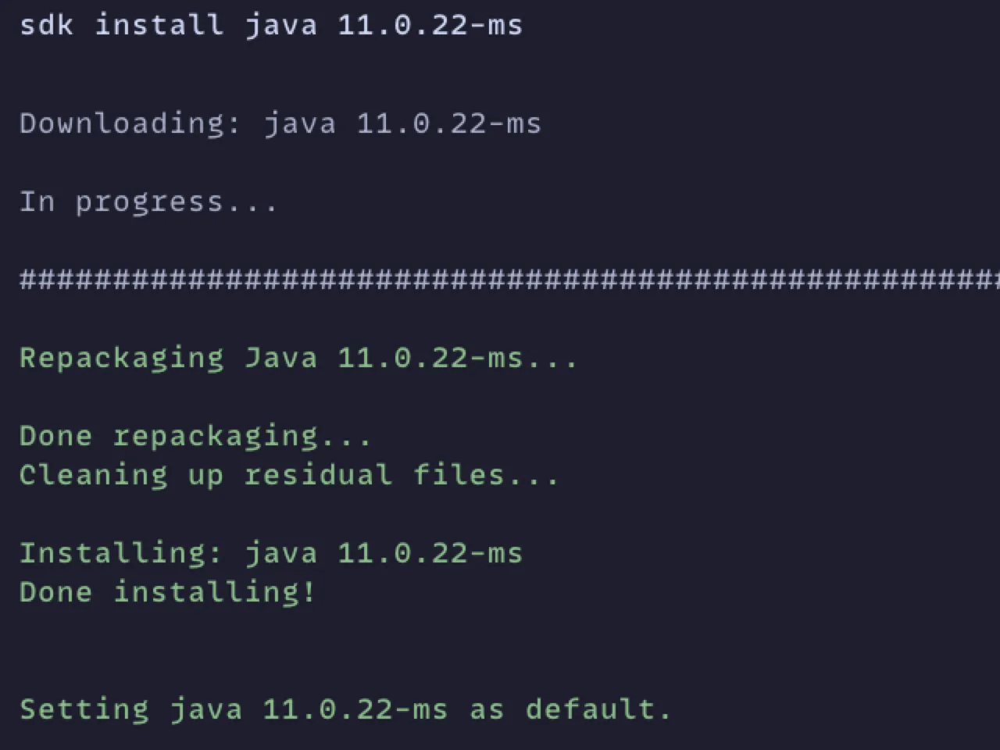
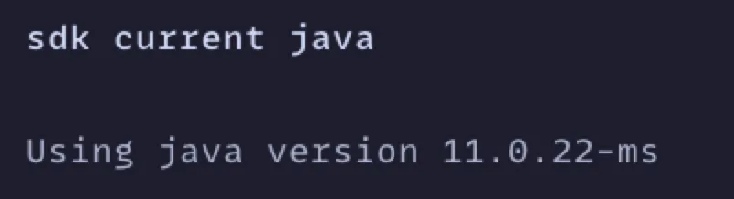

在 [學習 Spring Boot 3.0](https://www.tenlong.com.tw/products/9787302646518?list_name=srh) 這本書裡面，看到可以使用 [SDKMAN](https://sdkman.io) 來管理 java 的 `jdk`，感覺還蠻方便的

## 安裝

安裝很簡單，只要下一行 `shell` 就好 

```shell
curl -s "https://get.sdkman.io" | bash
```

好了之後，會再跟你說，需要再執行一個 `init shell`


都好了，可以執行 `sdk version`，確認一下 `sdkman` 的版本，看是不是都有安裝好了


## 管理

### list

可以下 `sdk list 套件` 就可以看到所有可以使用的套件版本，以這裡為例，就可以使用 `sdk list java` 看到所有 `jdk` 的版本

使用 `方向鍵` 就可以上下移動，要離開的話，可以用 `q`


可以使用的 jdk 可以參考 [JDKs](https://sdkman.io/jdks)，如果是其它的 sdk，可以參考 [SDKs](https://sdkman.io/sdks)

### install

要安裝的話，可以下 `sdk install 套件 版本號`，這裡以安裝 `微軟 ms` 的 11 版為例，就是 `sdk install java 11.0.22-ms`

如果安裝的是，這個套件的第一個版本的話，預設會變成 `default` 的版本，下面也會有提示



也可以使用 `sdk current 套件`，來看目前的版本



如果再裝一個不同版本的話，就會問你要不要切換成預設版本


### use

如果要切換版本的話，一個用法是 `sdk use 套件 版本號`，這裡以切換 `21` 和 `11` 的版本為例，就是 `sdk use java 21.0.2-ms`

可以使用 `sdk current java` 和 `java --version` 來確認版本


這裡要注意的是，使用 `use` 的話，只會在這個 `shell` 的視窗生效，下面也會有提示文字告訴你

### default

如果要切換預設版本的話，可以使用 `sdk default 套件 版本號`，這裡以切換 `21` 和 `11` 的版本為例，就是 `sdk default java 21.0.2-ms`


### 查看已經安裝的版本

可惜的話，我好像沒有看到有什麼指令，可以直接查看在 `local` 已經安裝的版本，就只能在 `list` 一次

有安裝的話，會顯示 `installed`，預設的版本的話，會顯示 `>>>`

如果像 `jdk` 這樣子版本很多的話，真的還蠻不方便的


---

- 相關可以使用的操作指令可以參考 [Usage](https://sdkman.io/usage)

> Photo by [Markus Spiske](https://unsplash.com/@markusspiske?utm_content=creditCopyText&utm_medium=referral&utm_source=unsplash) on [Unsplash](https://unsplash.com/photos/a-close-up-of-a-computer-screen-with-a-keyboard-o-0YxiJUK3s?utm_content=creditCopyText&utm_medium=referral&utm_source=unsplash)

