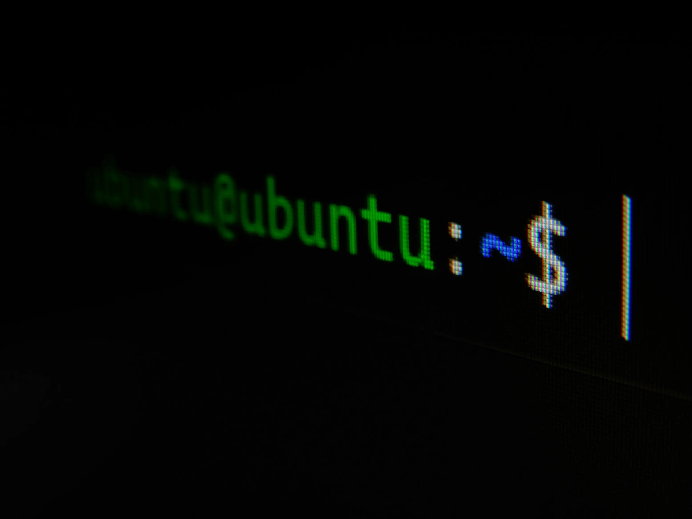

因為一直以來都有在使用 `Parallels`，開發一些只能跑在 windows 上面的程式，又很怕資料不備份會不會有問題，於是就寫了一個 `shell` 來處理，其實只是備份資料夾而已 😂

使用 `tar` 的原因是備份的速度會比較快，你也可以換成 `7z` 或是其它的

```shell
#!/bin/bash

# 取得當前日期
current_date=$(date +'%Y%m%d')

# 遍歷此資料夾下面，所有的資料夾
for folder in */; do

    # 去掉結尾的 /
    folder="${folder%/}"

    echo "開始備份 $folder"

    # 建立備份檔案名稱
    backup_filename="$folder.$current_date.tar"

    # 使用 tar 壓縮資料夾，刪除 -v 參數以移除詳細輸出
    tar -cvf "$backup_filename" "$folder"

    # 輸出備份完成訊息
    echo "$folder 備份完成，檔案名稱為 $backup_filename"
done
```

> Photo by [Gabriel Heinzer](https://unsplash.com/@6heinz3r?utm_content=creditCopyText&utm_medium=referral&utm_source=unsplash) on [Unsplash](https://unsplash.com/photos/green-and-black-digital-device-xbEVM6oJ1Fs?utm_content=creditCopyText&utm_medium=referral&utm_source=unsplash)