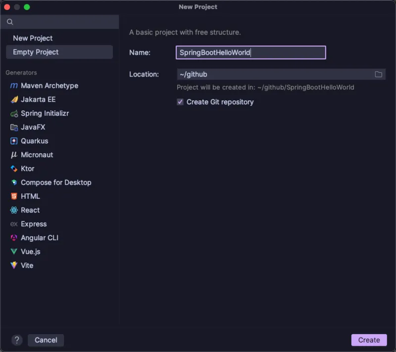
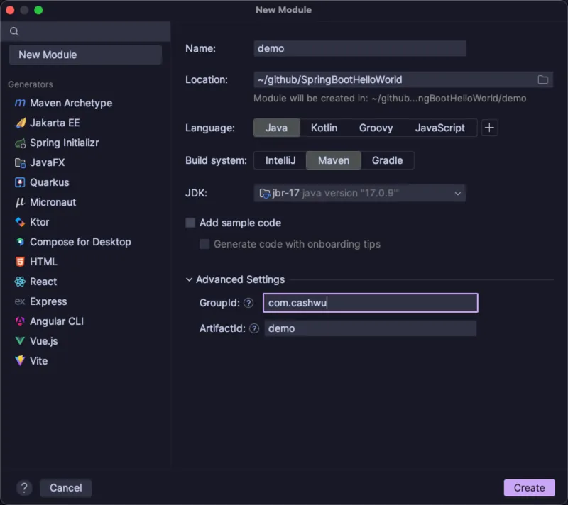
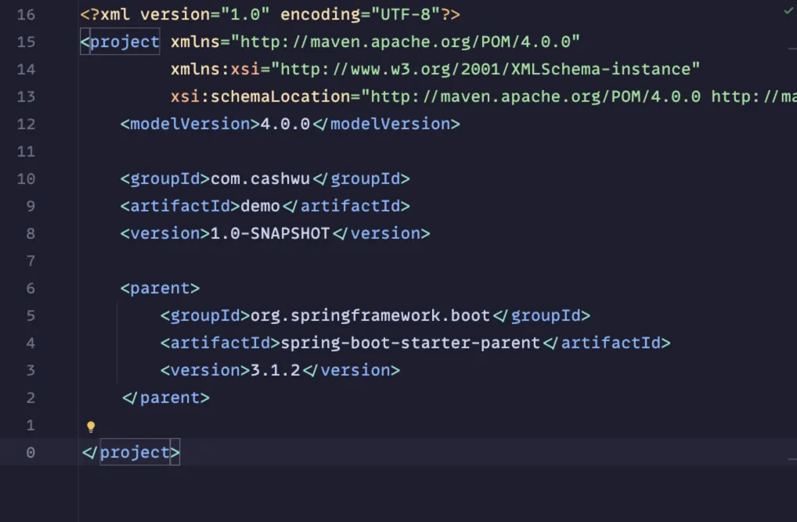
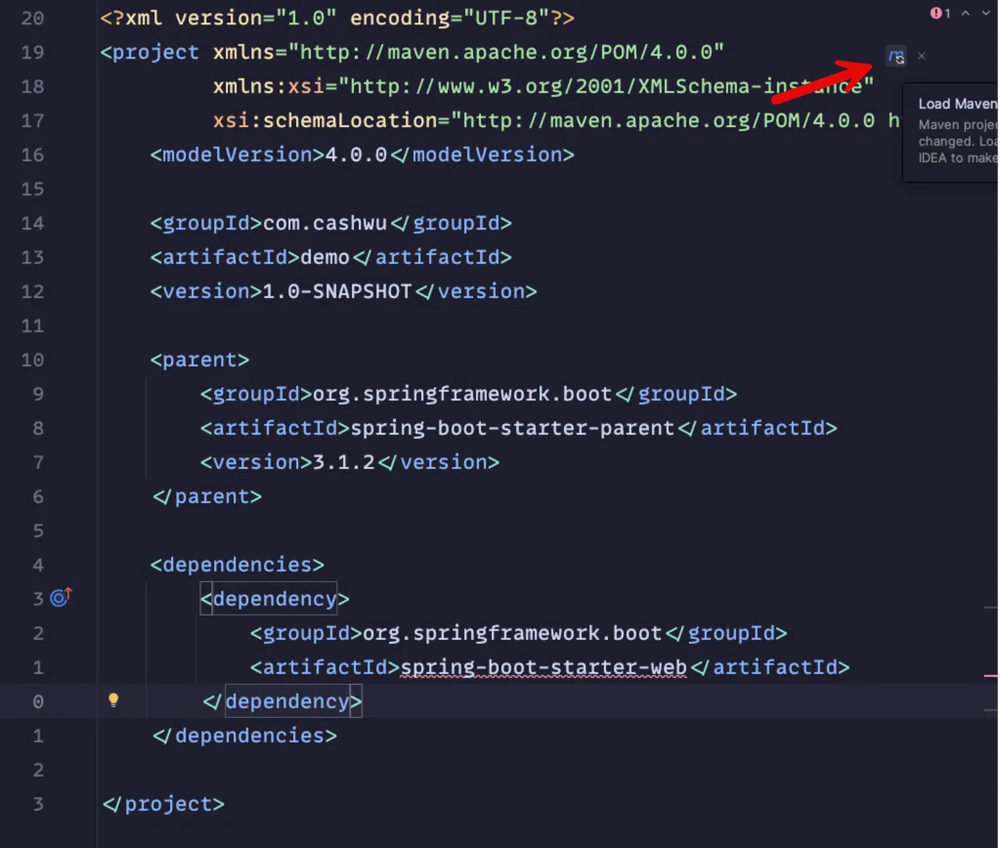
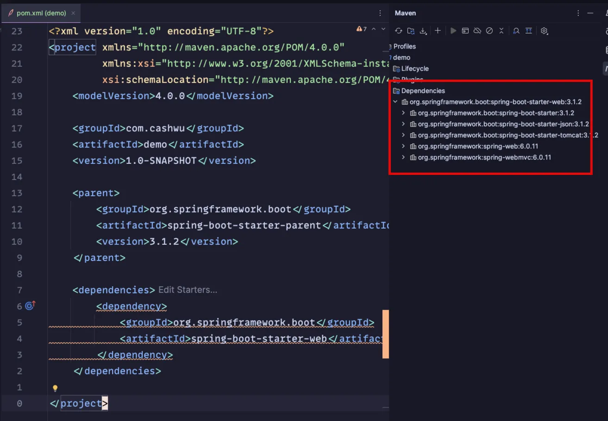
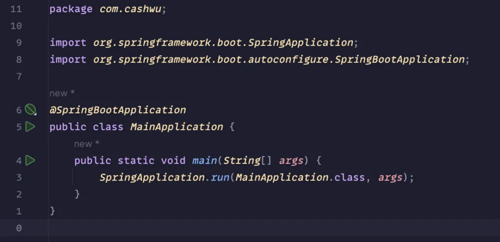
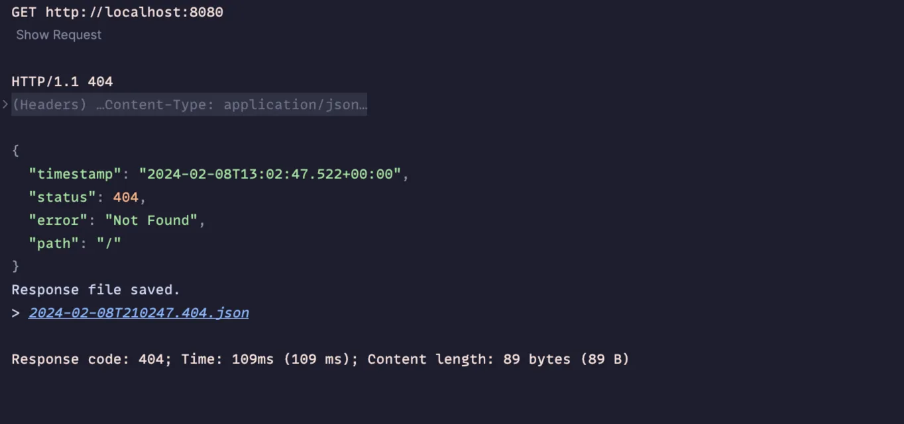
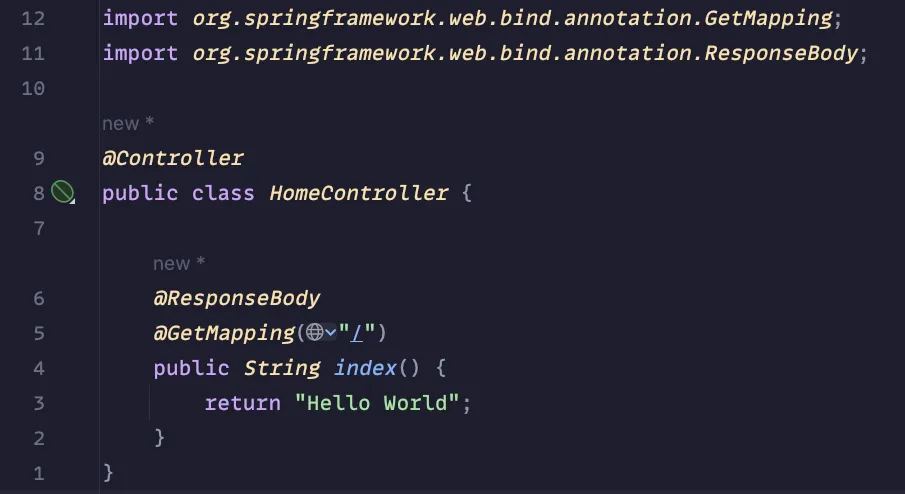
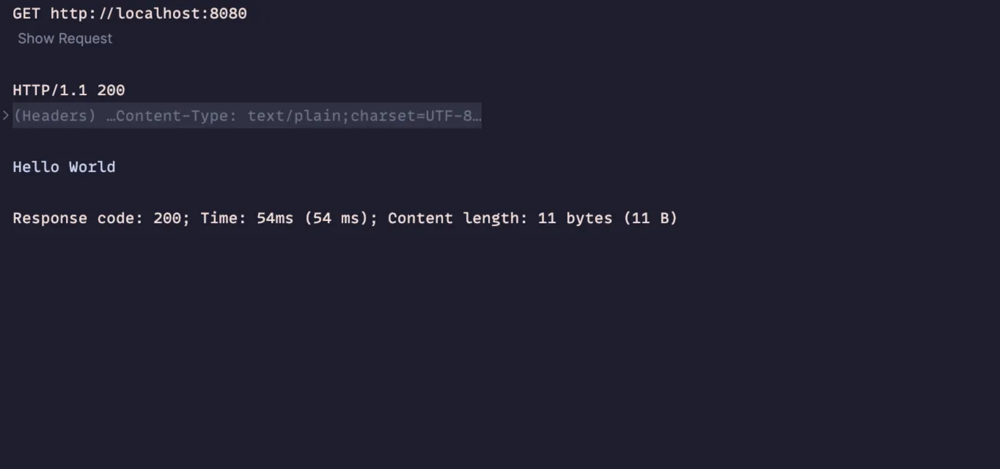

> 相關的步驟和程式碼，參考自[官方文件]( https://docs.spring.io/spring-boot/docs/current/reference/htmlsingle/#getting-started.first-application)

1. 先用 IntelliJ 建立空的專案



2. 建立完專案，建立一個新的 `module`，這裡我們先用 `Maven`，並且使用 JDK 17



3. 建立好了後，在設定檔 `pom.xml`，先加入 spring boot 的 parent 設定。這是每一個專案一定會有的設定

```xml
<parent>
    <groupId>org.springframework.boot</groupId>
    <artifactId>spring-boot-starter-parent</artifactId>
    <version>3.1.2</version>
</parent>
```



4. 接著加入 web 的一個啟動器 starter，官方相關的 starter，可以參考[官方文件](https://docs.spring.io/spring-boot/docs/current/reference/htmlsingle/#using.build-systems.starters)

 - 加入之後，應該會有紅線，看到右上角有一個 reload 的按鈕，點一下，讓專案可以下載相關依賴的元件

```xml
<dependencies>
    <dependency>
        <groupId>org.springframework.boot</groupId>
        <artifactId>spring-boot-starter-web</artifactId>
    </dependency>
</dependencies>
```



5. 好了之後，應該可以在 Maven 的視窗看到相關的依賴元件



6. 建立一個 java 程式的進入點 (main)，在 class 上面加上一個 `SpringBootApplication` 的 annotation，然後程式碼就一行，run
 

```java
@SpringBootApplication
public class MainApplication {
    public static void main(String[] args) {
        SpringApplication.run(MainApplication.class, args);
    }
}
```



7. 這個時候就可以使用 class 前面的執行按鈕跑起來看看，相關的 log 應該會出現在執行視窗，預設 `Tomcat` 的 port 是在 `8080`


8. 如果這個時間直接去瀏覽的話，應該會看到 Error 畫面，因為我們還沒有寫任何的 api/頁面，不過看到畫面就表示有正常的執行了


9. 如果用 api 的方式呼叫的話，應該會拿到 `404` not found



10. 我們加入一個 `HomeController` 和一個 `index` 的方法，記得加入相關的 annotation
    
```java
@RestController
public class HomeController {

    @ResponseBody
    @GetMapping("/")
    public String index() {
        return "Hello World";
    }
}
```



11. 這個時候在打一次 api，應該就可以看到我們寫的 `Hello World` 了



