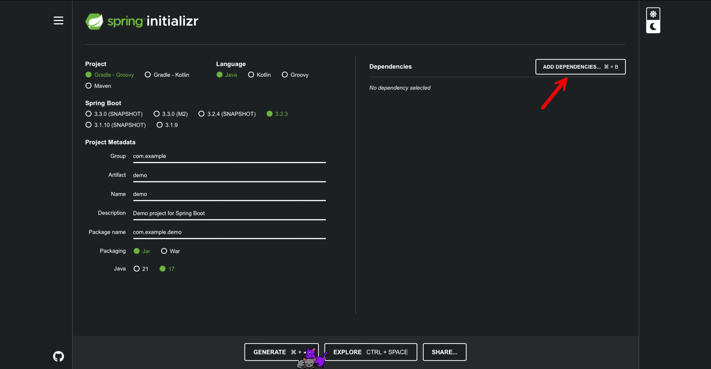
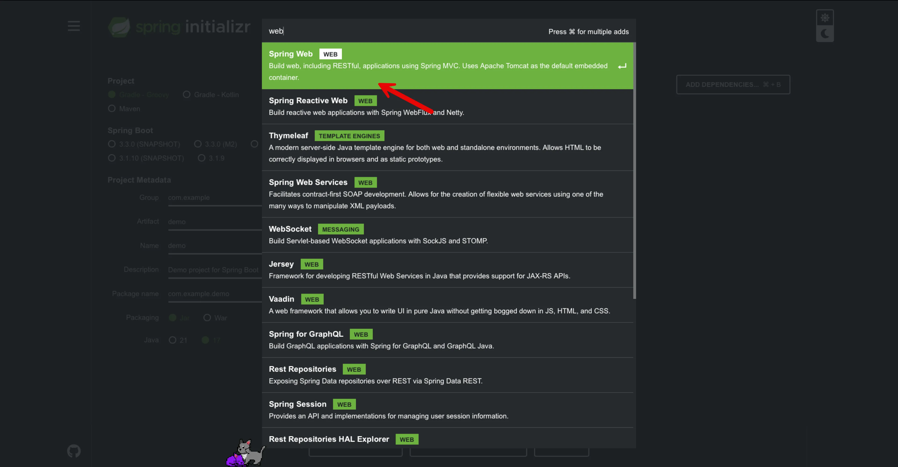
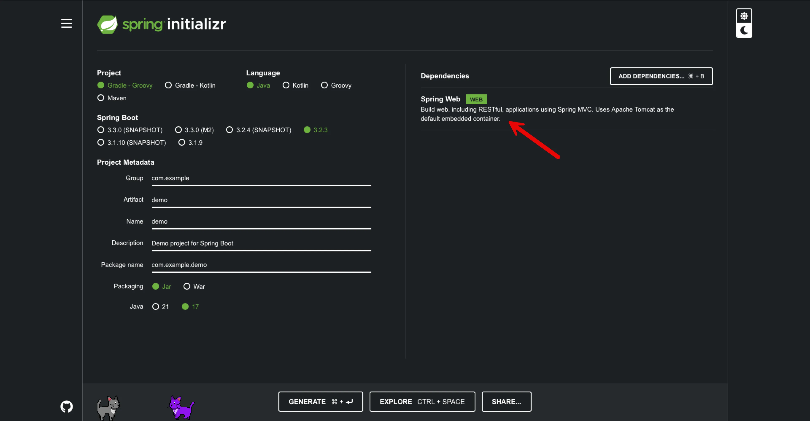
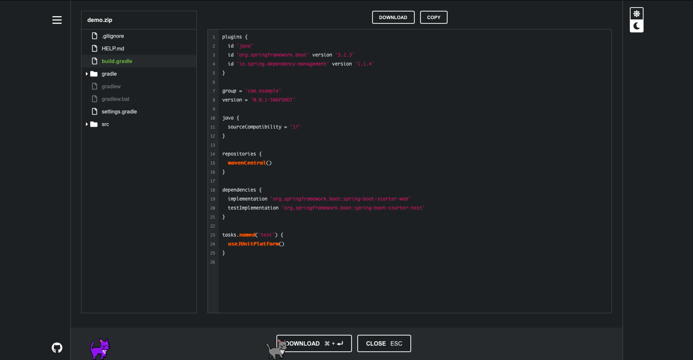
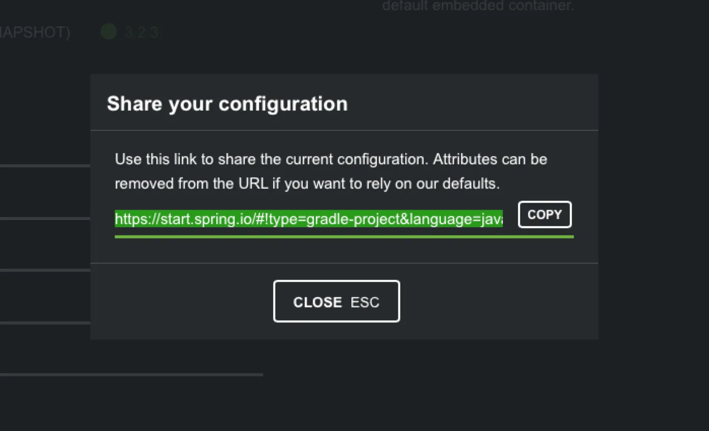
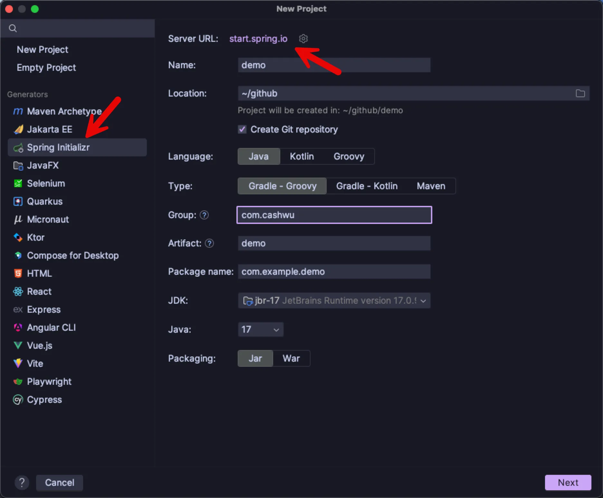
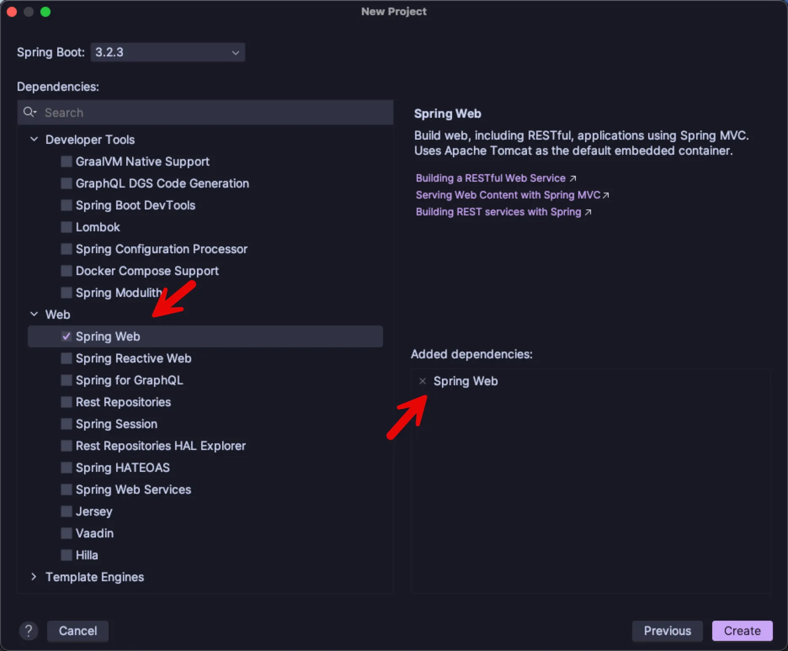

先前寫了兩篇文章，來介紹怎麼建立 spring boot 專案

- [Spring Boot Hello World 從 0 到 1 建立專案 - maven]()
- [Spring Boot Hello World 從 0 到 1 建立專案 - gradle]()

不過，一般來說，不可能從頭到尾都自己手動建立，這樣子也太麻煩了，這次就來看，怎麼使用官方提供的方式來建立專案

官方有提供一個非常方便的方式，可以在線上產生 spring 專案，然後下載，它叫做 `spring initializr`

[官方網頁](https://start.spring.io)，也非常好記 `start.spring.io`

---

## 官方 spring initializr 網頁

一進到畫面，可以看到網頁的左邊是基本的 `Metadata` 輸入，右邊的話，可以加入相關的`依賴套件`

在這裡可以搜尋相關的套件，按 `enter` 就可以直接加入

回到畫面上就可以看到有這個依賴

按下面的 `Explore` 就可以預覽看到，這次要產生的相關檔案

按 `Share` 的話，還可以把這次的相關資料分享給其它人

按 `Generate` 的話，就可以下載這次產生的專案

## IntelliJ IDEA 

如果在 IntelliJ 新增專案時，也可以選擇 `Spring Initializr`，可以看到最上面有一個 `Server URL`，基本上就是官方的網址

要填的欄位基本上跟官方的 `Metadata` 是一樣的

按下一步之後，就可以選擇相依的套件

再按下一步就可以產生專案了

---

相比`官方網頁`，在 `IntelliJ` 裡面直接新增專案會比較直覺和方便

不過，官方網頁也是有另外的用途，如果要加入一個新的依賴套件，不知道怎麼寫的話，就可以用官方的網頁，先加入，然後使用 `Explore` 看它怎麼寫的 😄

> 圖片來源：網路。若分享內容有侵害您的圖片版權，請來信告知，我們會及時加上版權信息，若是您反對使用，本著對版權人尊重的原則，會儘速移除相關內容。
