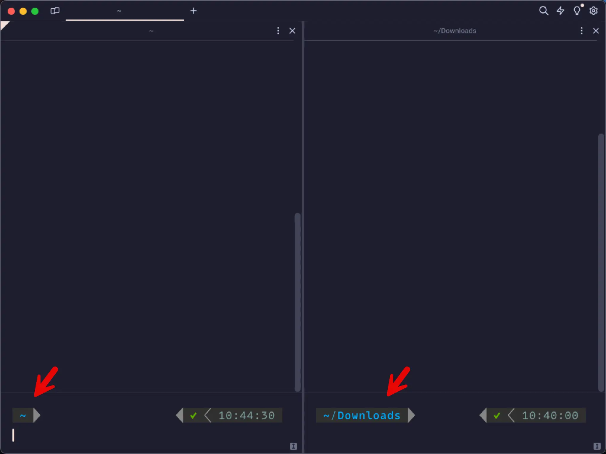
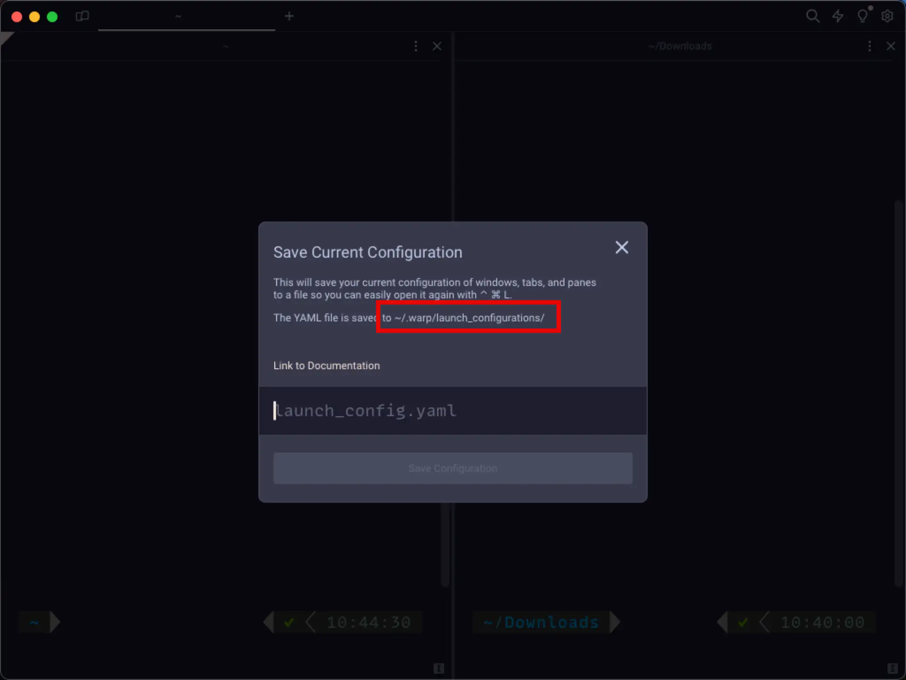
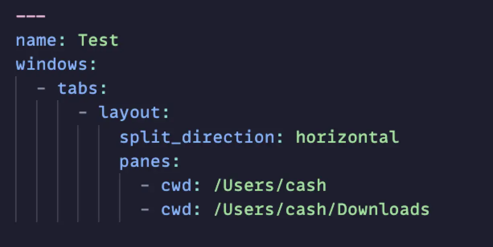
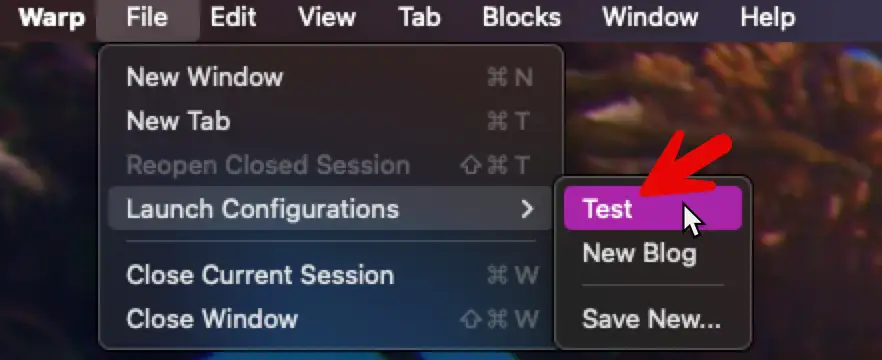
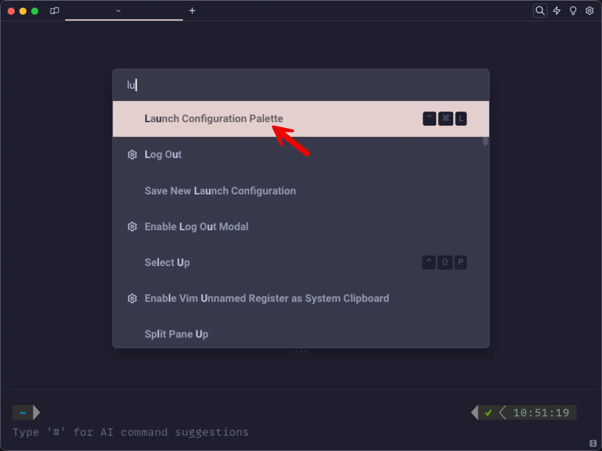
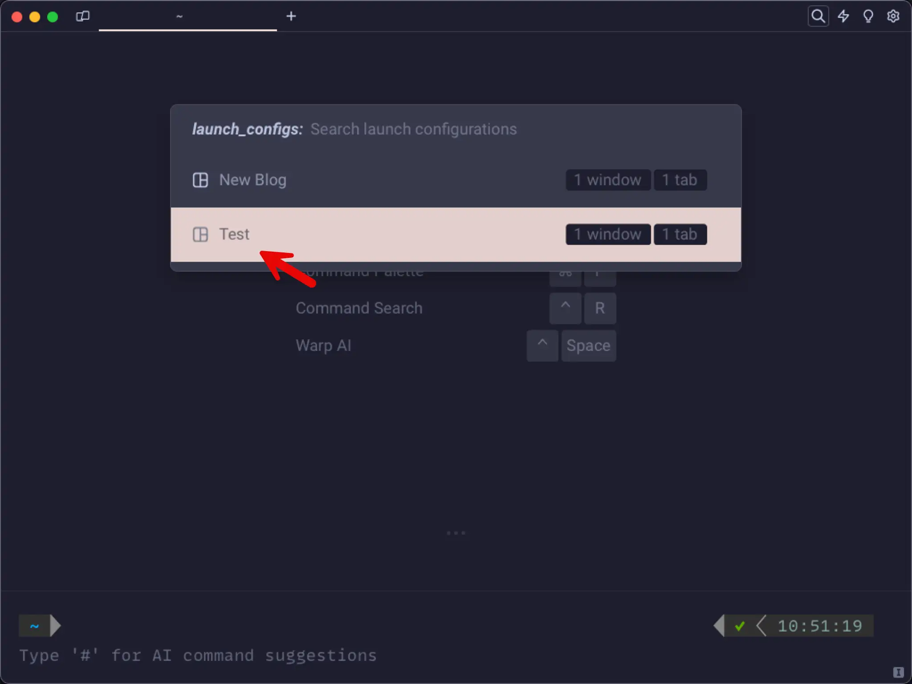
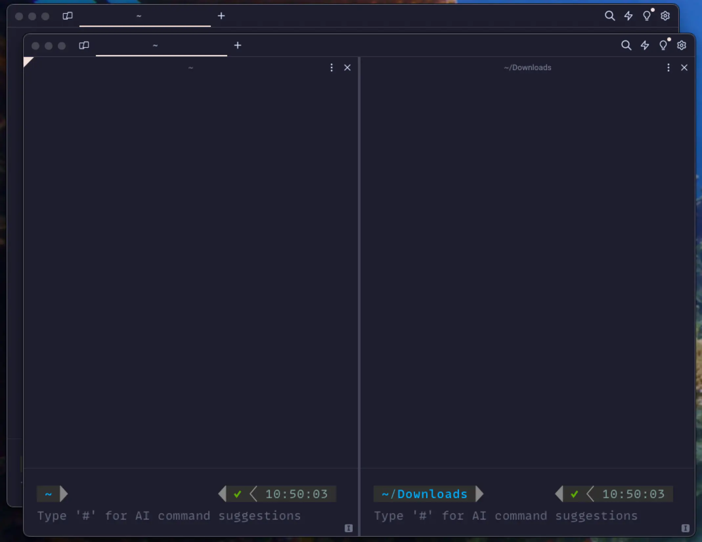
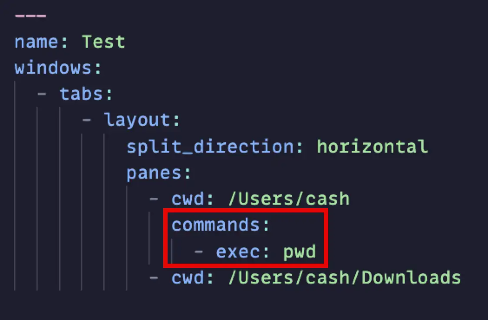
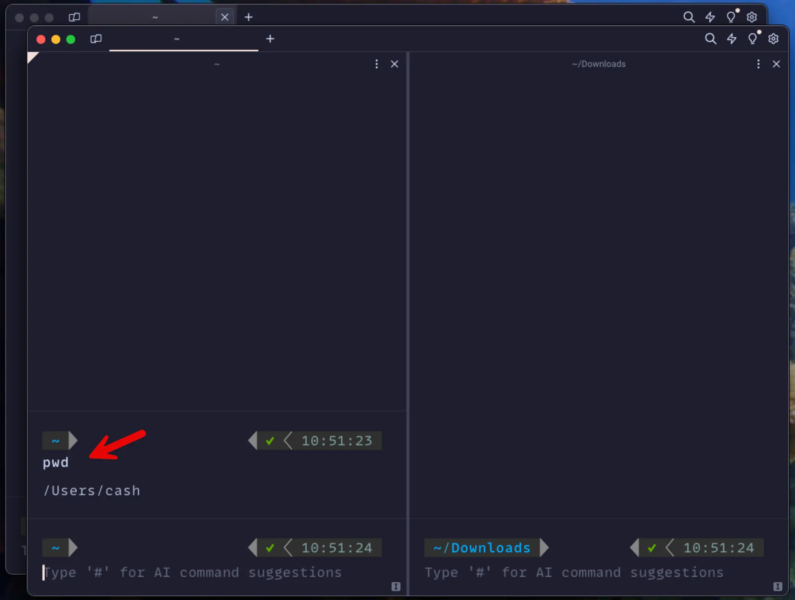

Warp 的 `Launch Configurations`，我個人覺得有點類似 Workspace 的概念，它可以把自己目前操作的視窗相關資訊存起來，下次可以快速的回復，而且還可以跑指定的 command，會讓整個操作變的很自動化

可以參考一下官方的文件 [Launch Configurations](https://docs.warp.dev/features/sessions/launch-configurations)

## 儲存設定檔

以下圖為例，是一個左右分割的視窗，然後右邊是定位到 `Downloads` 資料夾

有兩種方式可以存設定檔

你可以在選單裡面的 `File > Launch Configurations > Save New...` 存起來

也可以用命令視窗的 `Save New Launch Configuration` 存起來

之後會跳一個叫你輸入 `Configuration 名稱` 的視窗

上面也有提示跟你說，所有的設定檔都是存在 ` ~/.Warp/launch_configurations/` 這個路徑下面

存好了之後也可以直接開啟剛才的 `YAML` 設定檔

內容是長這個樣子，個人是覺得還蠻好懂的

## 使用設定檔

要使用的話，有兩個方式

一個也是從選單裡面的 `File > Launch Configurations > <名稱>`，就可以看到剛才設定的名稱，點它就好了

另一個方式也是從命令視窗，`Launch Configuration Palette`，點了之後就有設定檔的 `名稱` 讓你選

點了之後就會開一個新的 Warp 視窗，跟我們剛才存下來的視窗是一樣的

## 修改設定檔

我們也可以在啟用設定檔的時候叫它執行一些命令
 
加了一個簡單的 `pwd` 命令測試一下

再下一次使用設定檔時，就會一起執行命令了

> Photo by [Joshua Sukoff](https://unsplash.com/@joshuas?utm_content=creditCopyText&utm_medium=referral&utm_source=unsplash) on [Unsplash](https://unsplash.com/photos/yellow-and-black-spiral-light-9jBqWo7MgaU?utm_content=creditCopyText&utm_medium=referral&utm_source=unsplash)