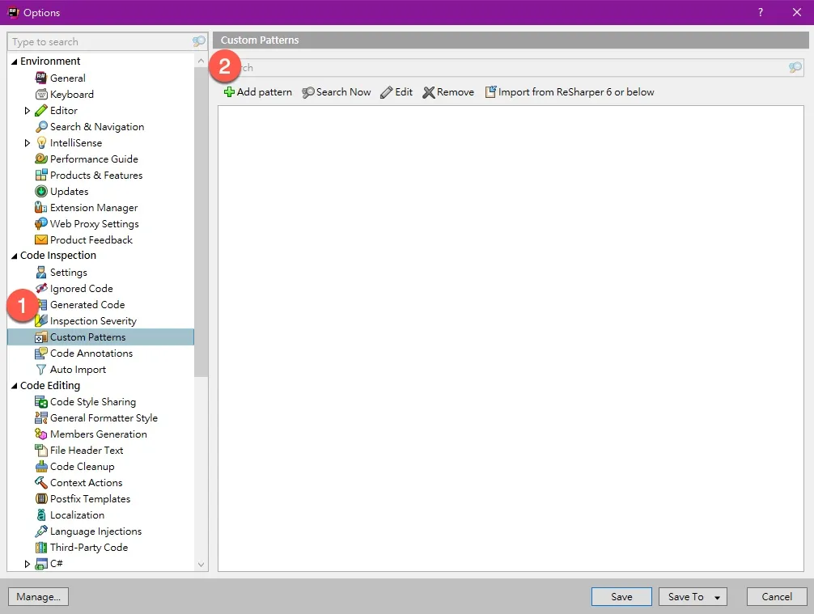
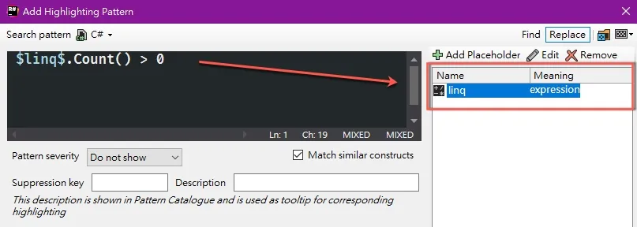
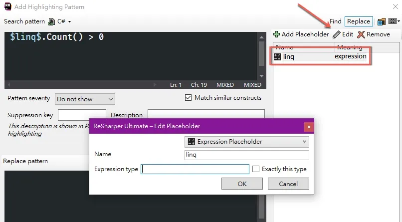
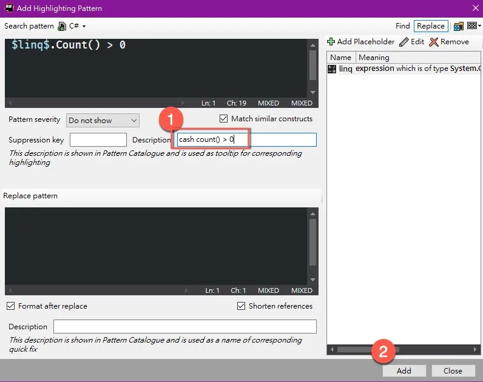

> 這裡使用的是 VS 2019 + ReSharper 2020.1
<!-- > 文章內容來自 91 的極速開發課程，有興趣的請參考 [202401 課程連結](https://tdd.best/courses/extreme-developing-202401/) -->


ReSharper 裡面有一個非常強大的功能叫 `Structural Search and Replace` (簡稱 `SSR`)，類似 Regular Expression 一樣，可以找到類似 `Structural` 的程式碼，也可以把它 `Replace` 掉，更可以變成 VS (Rider) 裡面的 `燈泡`

>  ReSharper 官方的 [SSR 介紹連結](https://www.jetbrains.com/help/resharper/Navigation_and_Search__Structural_Search_and_Replace.html)


## 定義 Search Pattern

來到 ReSharper 的設定頁面，找到 `Custom Patterns`，新增一個 `Pattern`




畫面左邊上面是 `Search Pattern`，下面是 `Replace Pattern`，畫面右邊是`Placeholder`，右上角預設會選擇 `Replace`，


在 `Search Pattern`  裡面寫下圖片裡的程式碼，意思是要找出任何使用 linq 的 `Count() > 0` 的程式碼，因為前面的型別有可能不一樣，所以這個部分要變成 `Placeholder` 另外設定，關鍵字需要使用 `$$` 包起來，加入後右邊會出現剛才加入 `Placeholder` 的內容




在 linq 上面點選兩下進入，或是點上方的 `Edit`，進入 `Edit Placeholder` 




在 `Expression type` 裡面輸入型別的 `namespace`，這裡會跳出提示


輸入 `System.Collections.IEnumerable` 後按 `OK`


寫下 `Description` 按 `Add`回到主畫面




選擇我們剛才新增的那筆 `Pattern` ，點選上方的 `Search Now`，就可以確認我們剛才寫的是不是如我們預期般


如果我們的程式碼如下

```csharp
static void Main(string[] args)
{
    var list = new List<int>();

    if (list.Count() > 0)
    {
    }
}
```


應該是可以找到，按 `Cancel` 離開 (因為還沒有定義 `Replace Pattern`，所以這裡按 `Replace` 和 `Cancel` 是一樣的)


## 定義 Replace Pattern

繼續編輯剛才的 Pattern

在 `Replace Pattern` 裡面寫下圖片裡的程式碼，意思把所有使用 `Count() > 0` 的使用 `Any()` 取代掉，下面的兩個選項建議維持打勾，寫下 `Description`，按 `Save` 後回到主畫面


在執行一次 `Search`，這個時候按 `Replace`，所有找到的程式碼就會被取代掉了


## 提示燈泡

如果程式碼需要有 `highlighting` 和燈泡的提示，要把右邊的選項改為 `Suggestion`


回到程式碼，就可以看到有 `highlighting`


燈泡上也會有提示


 

## 後記

SSR 是非常強大的工具，可以自己定義一些常見的程式碼 pattern，只要一鍵就可以把程式碼改成我們想要的樣子 !!


