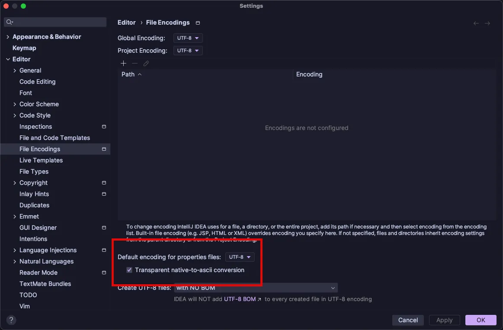

> 圖片來源：網路。若分享內容有侵害您的圖片版權，請來信告知，我們會及時加上版權信息，若是您反對使用，本著對版權人尊重的原則，會儘速移除相關內容。

> Photo by [Glen Carrie](https://unsplash.com/@glencarrie?utm_content=creditCopyText&utm_medium=referral&utm_source=unsplash) on [Unsplash](https://unsplash.com/photos/white-and-black-printer-paper-oHoBIbDj7lo?utm_content=creditCopyText&utm_medium=referral&utm_source=unsplash)

---

## 問題
## 原因
## 解法

## 參考連結