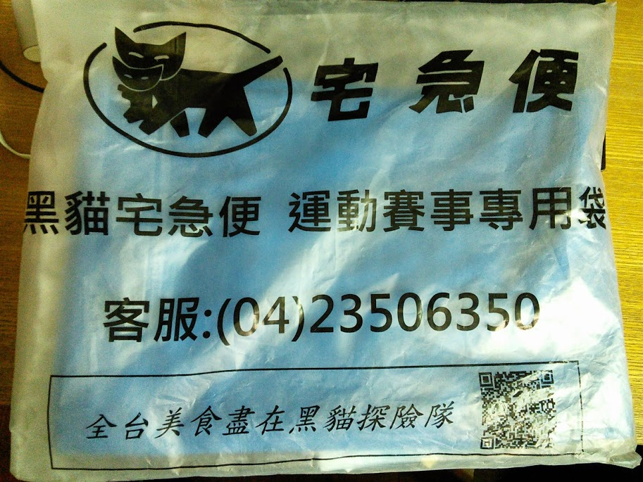
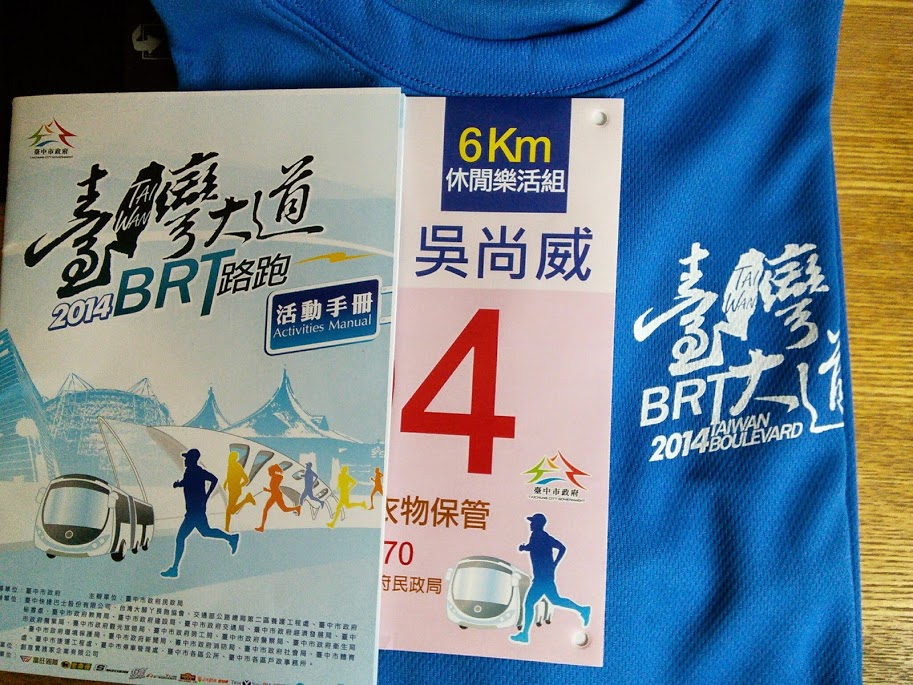
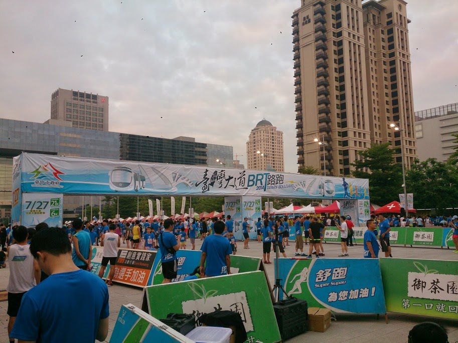
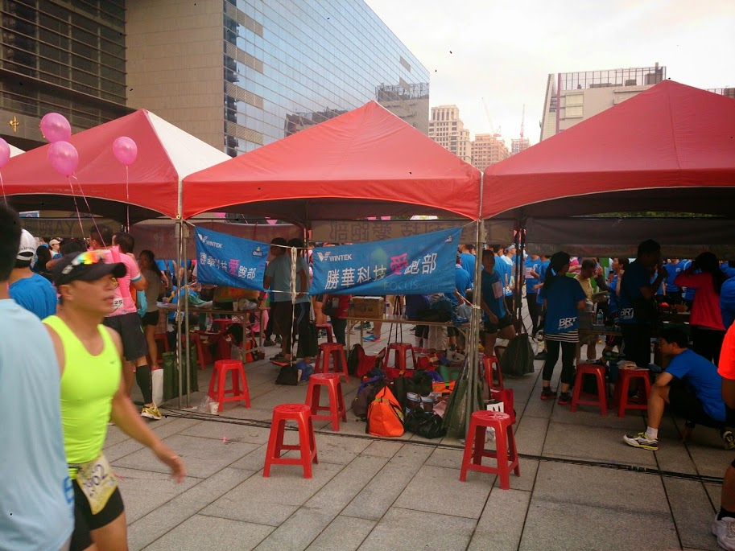
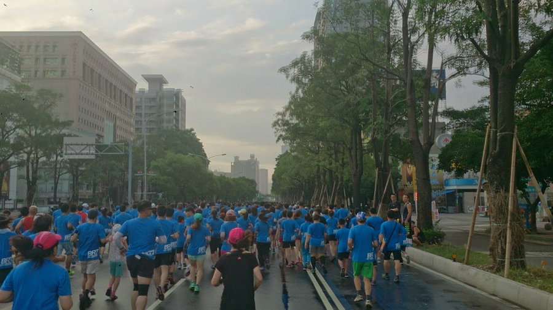
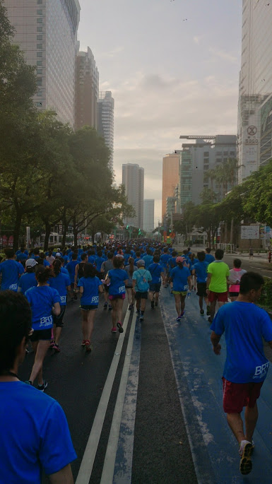
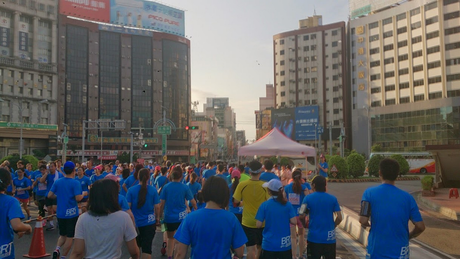
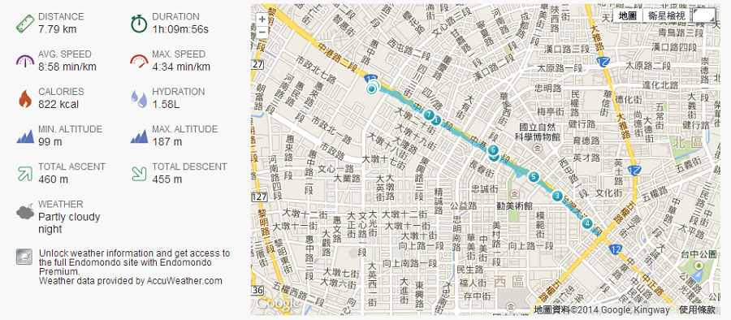

## 報名

今年報名 6 公里的休閒樂活組
而且今年的報名方式比較特別，東西不是親自去拿取，而是黑貓送上門，
原來黑貓也有這種服務

後來才知道，原來黑貓是今年的贊助之一

## 路跑當天

- 聽說今年 21 公里有 3千人報名， 6公里有 7千人報名
- 註：活動主持人的聲音好大

這是出發點

小強出現說話了

某大廠也有路跑社 ?

剛起跑過文心路，前面大約有 n 千人

到了廣三 sogo，前面一樣有 n 千人

五權路的折返點

今年的活動記念品

今天的距離跟時間