## 使用 EF 作 CRUD

### 資料列表

建立一個 `ClinetList Action`，先 `new` 出在第一步驟加入的 `EF`，用 `db` 取得 `客戶資料`，
並把資料傳給 `View`

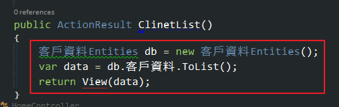

註：如果不知道名稱的話，可以點進 `EF`，按 `F4` (屬性)，裡面就會有

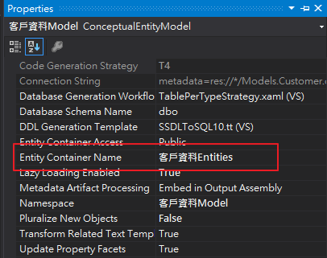

加入一個 `View`，樣版選擇 `List`，模型類別選擇 Controller 傳到 View 的資料類別，也就是 `客戶資料 (BlogTest.Models)`，
資料內容類別選擇的是加入的 `EF`，也就是 `客戶資料Entities (BlogTest.Models)`，執行後就可以看到畫面有資料了。

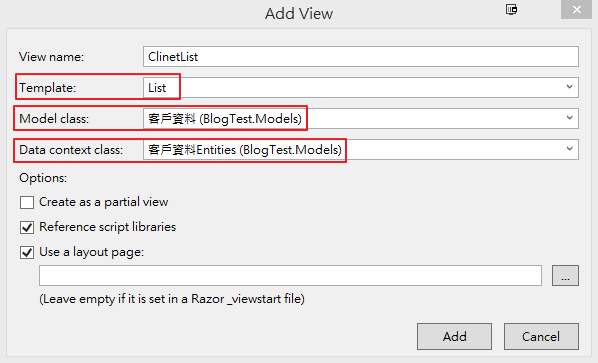

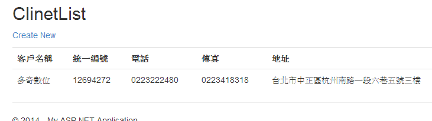

註：因為之後會一直用到 `db`，所以可以把它拉出來

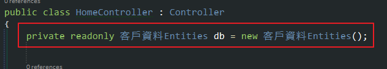

### 增加資料

建立一個 `ClientAdd Action`，建立一個 `客戶資料`，並且把這個 `物件` 加到 `db.客戶資料` 裡面，
最後下 `db.SaveChanges()` 把資料寫回資料庫

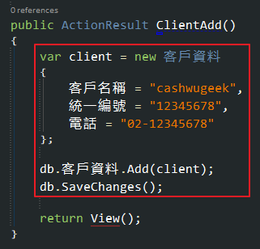

先執行 ClientAdd 頁面，在回 ClientList 頁面，資料應該會增加一筆

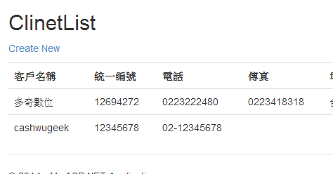

### 增加有關連的資料

- 第一種作法是 先新增客戶資料，在把 客戶資料的 Id assign 給客戶聯絡人 的 `客戶Id`

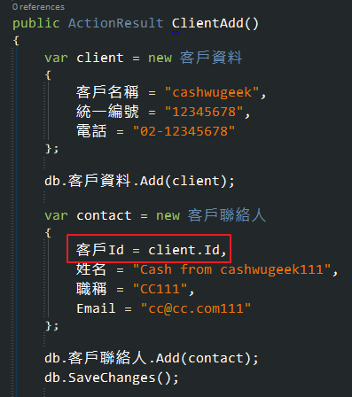

- 第二種作法是 先新增客戶資料，在建立物件關聯，把 客戶資料 assign 給客戶聯絡人的客戶資料

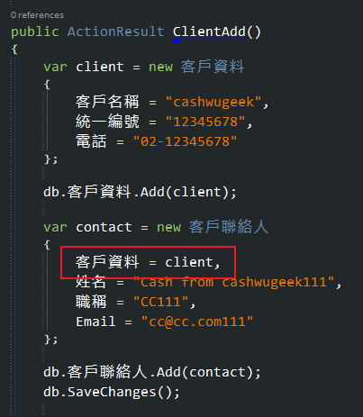

- 第三種作法是 把客戶聯絡人加到 客戶資料的 客戶聯絡人裡面，這樣子只要新增一次就好了

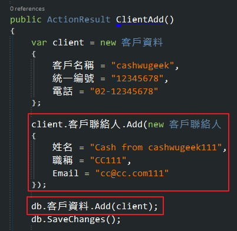

### 取出單筆資料

- 可以利用 `Find`，傳入 `key值` 取出一筆資料，可以看到 `Find` 是回傳一筆資料

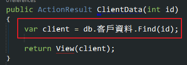

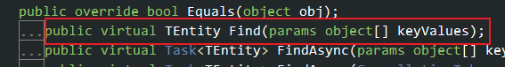

註：如果是單筆資料的話 `View` 的樣版是選擇 `Detail`

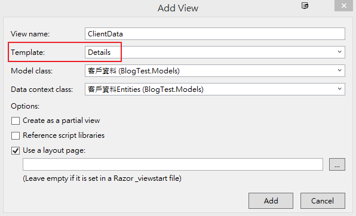

- 利用 `Where` 下條件取得資料，並用 `FirstOrDefault` 取得一筆資料，也可以改寫直接使用 `FirstOrDefault`

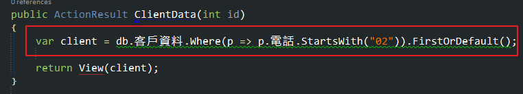

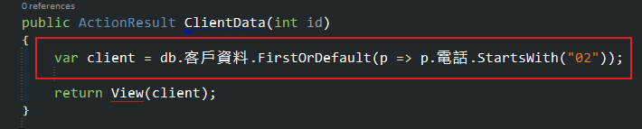

### 修改資料

- 單筆修改，可以利用前面的 `取出單筆資料` 然後把資料改掉，下 `SaveChanges()` 存回資料庫

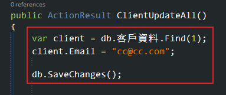

- 批次修改，可以用 loop 的方式把資料換改掉，下 `SaveChanges()` 存回資料庫

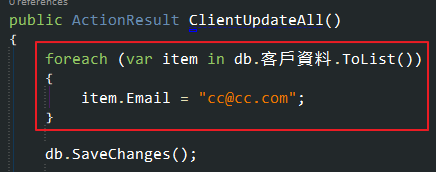

### 刪除資料

- 沒有關連資料，取出資料後下 `Remove`，就可以把資料刪除

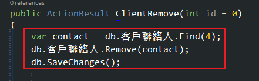

- 有關連資料，第一種作法，必需把下面所有的關連資料先刪除後在刪除原有的資料

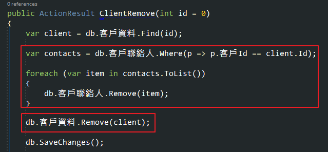

- 有關連資料，第二種作法，可以利用之前有用過的 `物件關聯`，用 `RemoveRange` 刪除

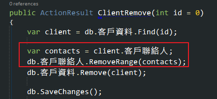