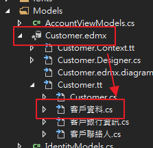
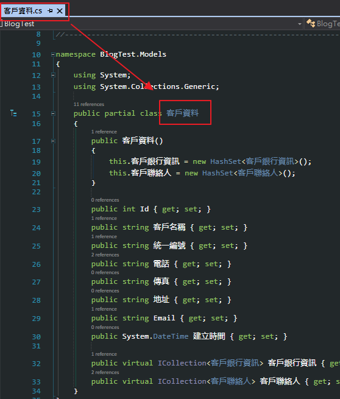
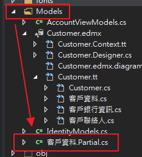
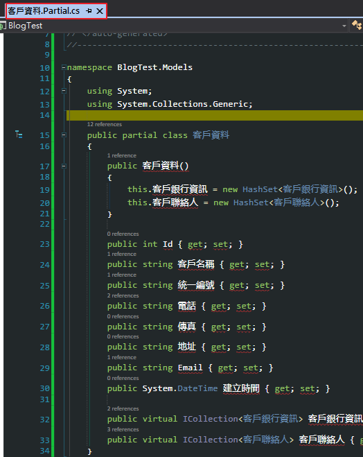
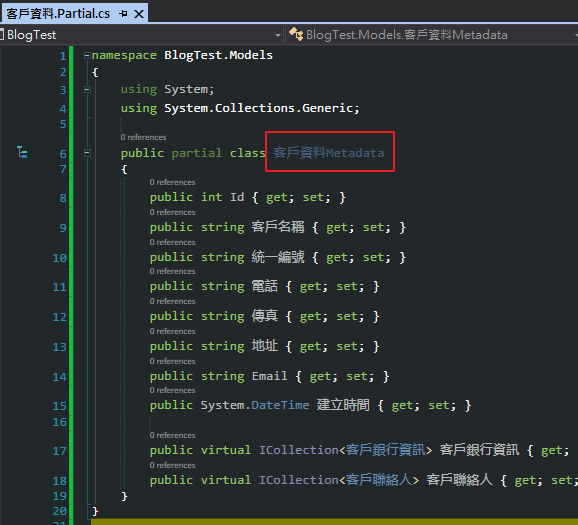
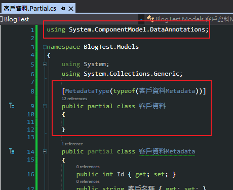

## 擴充資料模型 Matadata 的開發步驗

打開要擴充的 `.cs` 檔，
例如是 `客戶資料`，把 `tt` 檔下面的 程式碼全部 copy 起來

在 `Models 資料夾`下新增一個 class 叫 `客戶資料.Partial.cs`

把剛才的代碼貼上，會發現有錯誤，需要在作調整

- 1、把最上面的註解刪除
- 2、在類別名稱後面加上 `Metadata`，也就是 `客戶資料Metadata`
- 3、刪除 建構子

- 4、在現有的類別上面在建立一個 `Partial` 的類別，名稱跟原有要擴充的類別同名，也就是 `客戶資料`
- 5、在這個類別的上面套用 `MetadataType Attribute`，並指定是下面的 `客戶資料Metadata`，也就是 `[MetadataType(typeof(客戶資料Metadata))]`
- 備註：記得要 using `System.ComponentModel.DataAnnotations`

現在就可以在上面套用驗證屬性，不用擔心因為 `EF` 更新而被 Reset 了