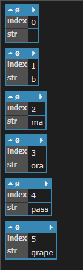

使用 Linq 的 select 時要拿到資料 index 的寫法

```csharp
string[] fruits = { "apple", "banana", "mango", "orange", "passionfruit", "grape" };
var query = fruits.Select((fruit, index) => new { index, str = fruit.Substring(0, index) });
foreach (var obj in query)
{
    obj.Dump();
}
```

結果

