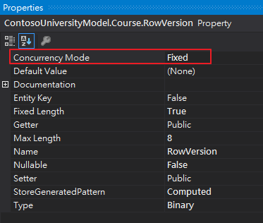
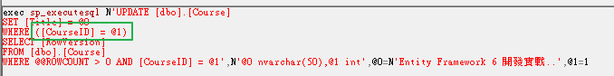
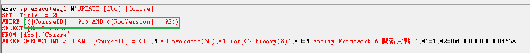

- 在需要並行處理的 Table 裡面加上一個型態為 `timestamp(rowversion)` 的欄位 

註：其實什麼欄位什麼型態都可以，只是一般來說比較常使用 `timestamp(rowversion)` 型態

- 在 edmx 裡面把加入欄位的 `Concurrency Mode` 屬性改為 `Fixed`

- 這樣子在 Update 的時候會送出該欄位作 `WHERE`

修改前

修改後

