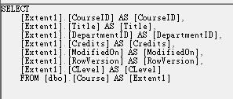
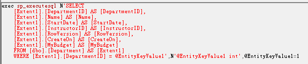
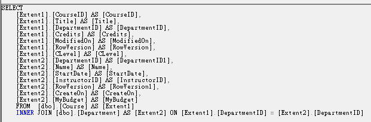

沒有使用 `Eager Loading` (預先載入、查詢計畫)時，有使用到導覽屬性會再下一次 Query 查詢導覽屬性

```csharp
using (var db = new ContosoUniversityEntities())  
{
    foreach (var item in db.Course)
    {
        Console.WriteLine(item.Title + "\t" + item.Department.Name);
    }
}
```





有使用 Eager Loading (預先載入、查詢計畫)時，會使用 `JOIN` 的方式查詢導覽屬性

```csharp
using (var db = new ContosoUniversityEntities())  
{
    foreach (var item in db.Course.Include(a => a.Department))
    {
        Console.WriteLine(item.Title + "\t" + item.Department.Name);
    }
}
```



### 注意事項

> 如果使用 Include 要使用強型別時需要 `using System.Data.Entity`