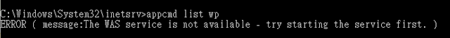
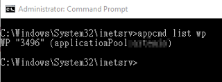

如果電腦跑很多站台的話
就沒有辦法從 Task Manager 知道是那一個 website
只可以看到 PID

可以在 cmd 打下面的指令，就可以知道 PID 和其相對應的 website

```shell
cd %windir%\system32\inetsrv
appcmd list wp
```

不過如果沒有用 administrator 的話會出錯



記得要用 administrator run cmd
在下面的圖就可以看到 PID 和 application Pool 的名稱



