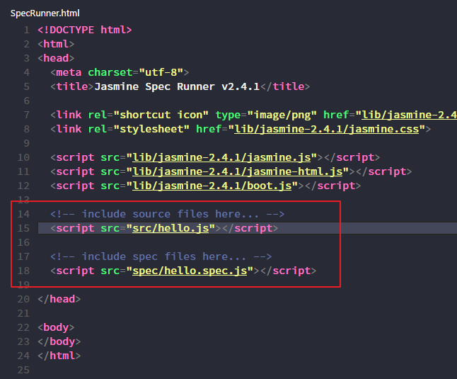
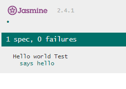
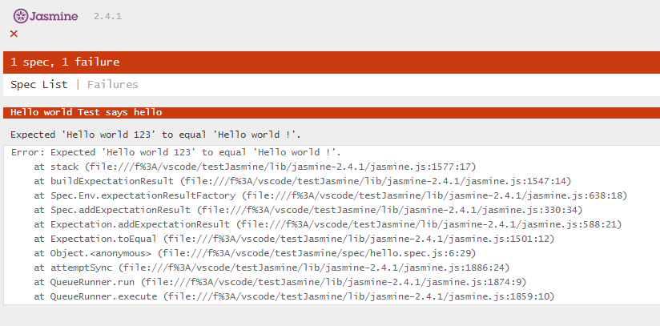

> using VSCode

1.download last version [Jasmine.js](https://github.com/jasmine/jasmine/releases) in Github, currently version is 2.4.1 (or using git clone it)

2.unzip it

3.install jasmine tsd in unzip folder
```shell
$ npm install -g tsd // if not install tsd  
$ tsd install jasmine --save // install node tsd file and save in tsd.json  
```
4.create `hello.js` file in `src` folder
```js
function helloWorld(){  
    return "Hello World !";
}    
```
5.create `hello.spec.js` file in `spec` folder
```js
describe("Hello world Test", function(){
   it("says hello", function(){
       expect(helloWorld()).toEqual("Hello World !");
   })
});
```
6.modify `SpecRunner.html` file, write `hello.js` and `hello.spec.js` path in script and remove other



7.browse `SpecRunner.html`, you can see `0 failures`



8.if modify `hello.js`
```js
function helloWorld(){  
    return "Hello World 123";
}  
```
9.refresh `SpecRunner.html`, you can see `1 failures`

