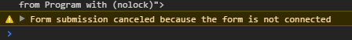
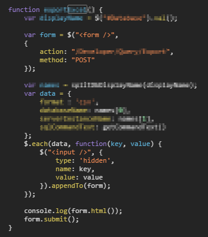

## 問題

在某次 Chrome 更新後，線上的系統突然沒有辦法送出表單，而且在 console 裡面出現警告




可以看到程式碼是動態建立一個 form，在把 form submit 出去



## 原因

因為不符合 HTML 的規範，所以 Chrome 把這個問題 Fix 掉了

## 解法

1、先把 form 加到 document，在 submit

```
$(document).append(form);
```

2、不要用動態 form XD

### 參考連結

https://html.spec.whatwg.org/multipage/forms.html#form-submission-algorithm