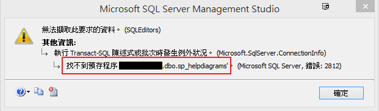
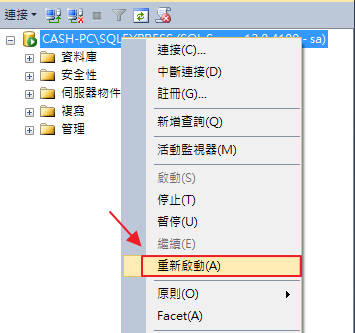

## 問題

今天使用 DB Project 還原到一個新的 DB 後，要建立資料庫圖表時會出現訊息說 找不到預存程序 `XXX.dbo.sp_helpdiagrams`

## 解法

重啟 DB 服務就好了 XD

### 參考連結

- [Could not find stored procedure' even though the stored procedure have been created in MS SQL Server Management Studio](https://dba.stackexchange.com/questions/23983/could-not-find-stored-procedure-even-though-the-stored-procedure-have-been-cre)