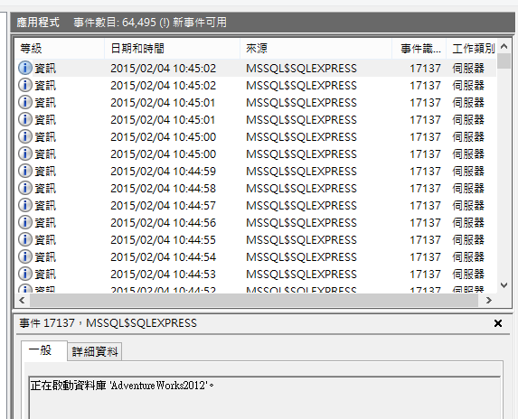

## 問題

在 windows 的事件裡面一直出現 `正在啟動資料庫 Adventure Works2012`



## 解法

```sql
ALTER DATABASE AdventureWorks2012
SET AUTO_CLOSE OFF
```
 


### 參考連結

http://sharedderrick.blogspot.tw/2009/02/autoclose.html  