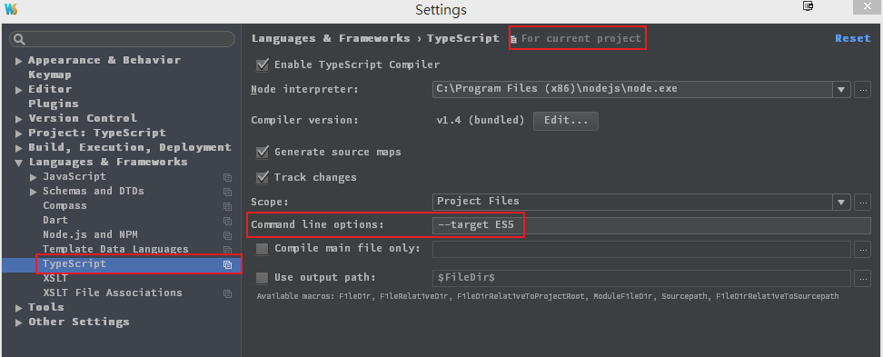
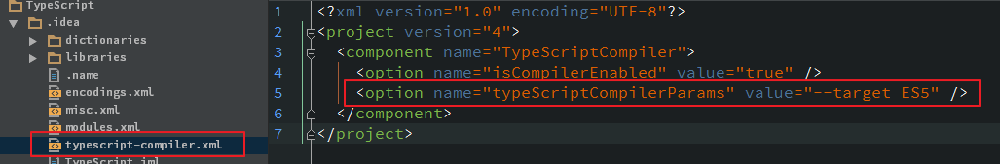

如果使用到 TypeScript 裡面的 get 和 set 的話，需要注意編譯時的指定

下面為官方的Note

> Accessors require you to set the compiler to output ECMAScript 5

在 WebStorm (v10) 裡面的改法有兩種

1、在 setting 裡面修改，找到 TypeScript 的地方，在Command line options 裡面打上 `--target ES`
(要注意的是修改的是只有目前的 Project)

2、直接在專案裡面的 `typescript-compiler.xml` 檔案加上 `<option name="typeScriptCompilerParams" value="--target ES5" />`

註：其實第一個作法也是在此檔案幫你加上這一行 option，只是第一種作法會比較方便

### 參考連結

- [TypeScript官網](http://www.typescriptlang.org/Handbook#classes-accessors)