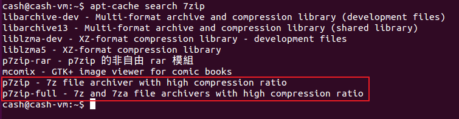
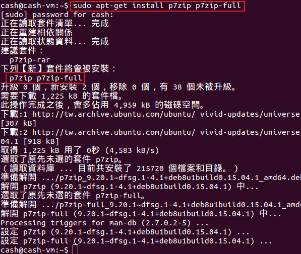
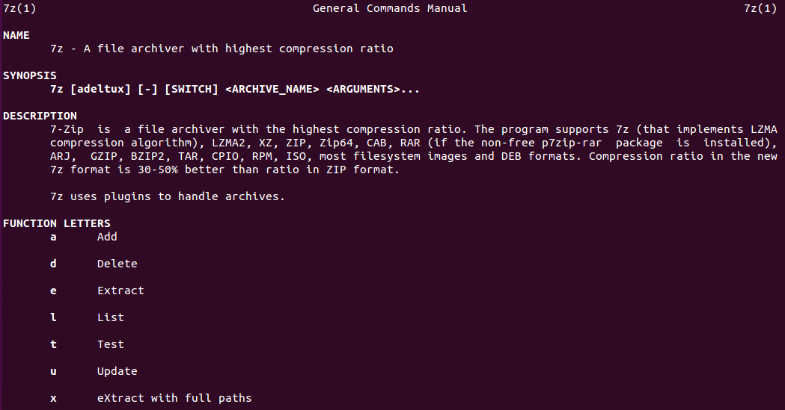
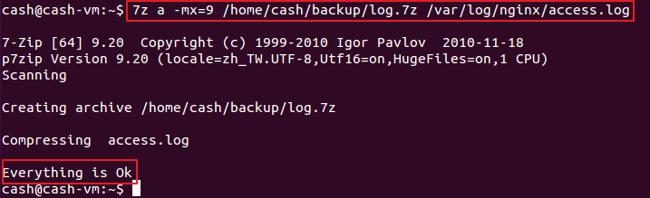
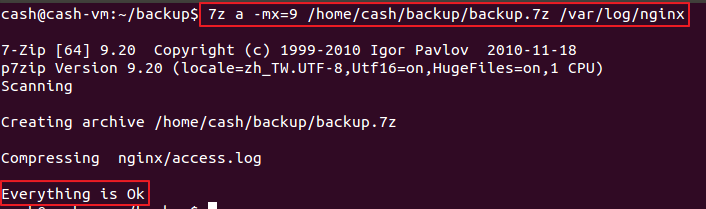
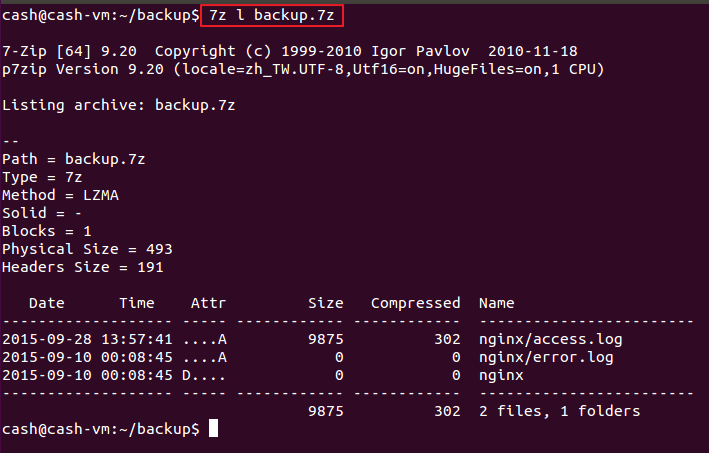
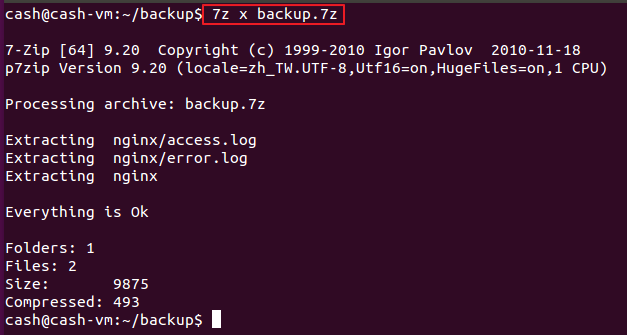

使用 `apt-cache search 7zip`，可以找到幾個相關的 package



## Install

```shell
apt-get install p7zip p7zip-full
```


> 註：因為不考慮使用 RAR，所以沒有安裝 `p7zip-rar`

## Use

基本的格式為 `7z <參數> <可選參數> <輸入的檔案(路徑+檔名)> <輸出的資料夾或檔案名>`

可以自行下 `man 7z` 看一下就大概知道怎麼用了



EX 1：
備份檔案 => `7z a -mx=9 /home/cash/backup/log.7z /var/log/nginx/access.log`



`-mx` 指的是壓縮率的意思，9 為最高

EX 2:
備份資料夾 => `7z a -mx=9 /home/cash/backup/log.7z /var/log/nginx/`



EX 3:
看壓縮檔的內容 => `7z l backup.7z`



EX 4:
解壓縮 => `7z x backup.7z`



## 參考連結

[在 Debian/Ubuntu 上的 7-Zip](http://blog.longwin.com.tw/2008/02/debian_ubuntu_linux_7zip_2008/)
[ubuntu 7-zip 壓縮檔案](http://smalldd.pixnet.net/blog/post/11356475-ubuntu-7-zip-%E5%A3%93%E7%B8%AE%E6%AA%94%E6%A1%88)
[GNU / Linux 各種壓縮與解壓縮指令](http://note.drx.tw/2008/04/command.html)