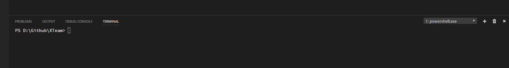
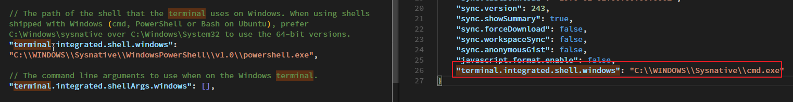

在某次 VSCode 更新後，內建的 terminal 預設變成是 powerhsell，實在是用不習慣，所以就找到設定檔把它改回 cmd




解法


在設定裡面，多加一行

```
"terminal.integrated.shell.windows": "C:\\WINDOWS\\Sysnative\\cmd.exe"  
```




參考連結

https://code.visualstudio.com/docs/editor/integrated-terminal