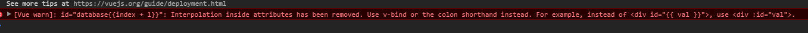

## 問題
如果在 vue 裡面你要使用 data 的值作為屬性的一部份時就會出現下面的錯誤

```js
<td class="VAM" id="database{{index + 1}}">  
```



## 解法

1、用 v-bind 改寫

```js
 <td class="VAM" v-bind:id="'database' + (index + 1)">  
```

2、用 method 改寫

```js
<td class="VAM" v-bind:id="databaseId(index)">

methods: {
    databaseId : function(index) {
        return "database" + (index + 1);
    }
}
```